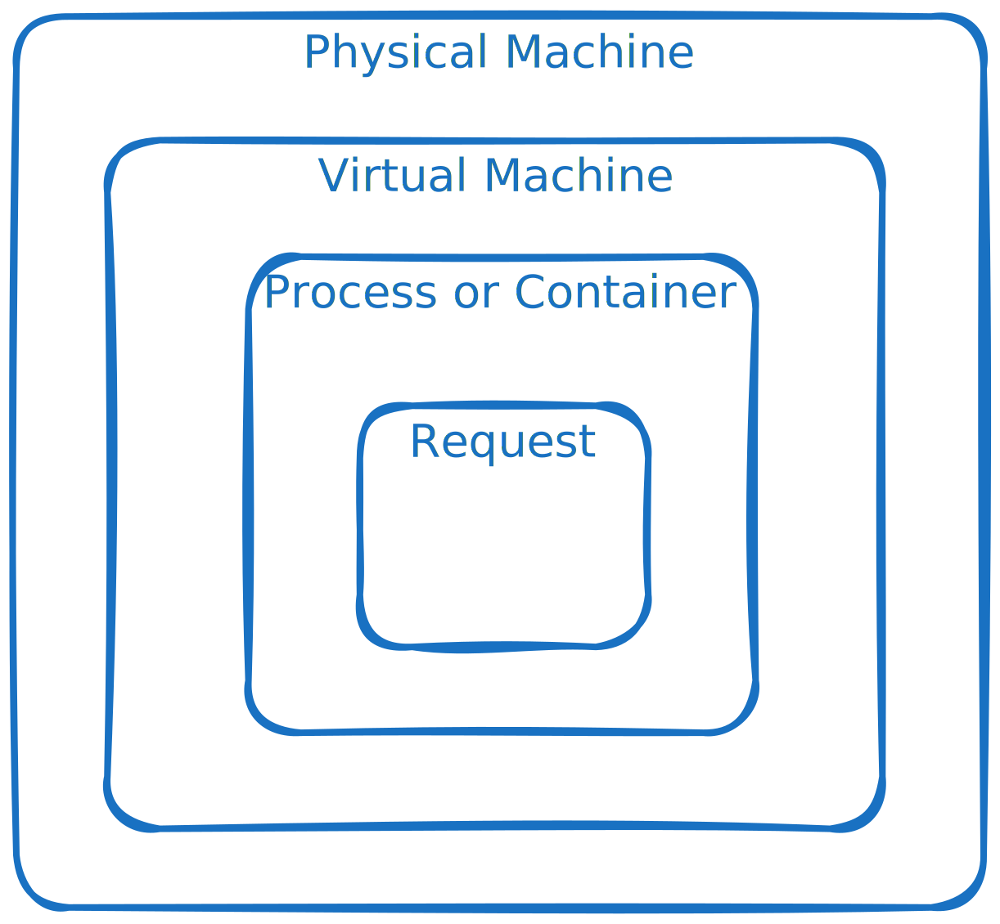

In Part 1 I suggested some sustainability non-functional requirements (NFRs) but avoided the hard question of how do you measure them; the truth is that with current tooling it can be hard. In this post I’ll try and address that with principles and ideas around how you can measure and enforce your sustainability NFRs so as to ensure they are met not just on initial release but over time without degradation. 

I’ll continue to focus on CO2 emissions because it is the area of sustainability that development teams have the most control over (as opposed to say water usage) and concentrate on software rather than embodied emissions which is for the manufacturer to measure. 

Just as a quick recap, some sustainable NFRs are:

 * “Each request/workflow execution should generate N grams of CO2”
 * “Server utilisation should be > 50%”
 * “Resources should not use energy when inactive”, i.e. scale down when you can

## What do we want to achieve
In software architecture we sometimes talk about fitness functions and these are about ensuring a system meets its non-functional requirements. The aims of these functions are to ensure:
1.	NFRs are achieved on initial launch of a system or component
2.	NFRs continue to be achieved over time as changes happen to the system
2 is of particular importance because a lot of software generally degrades over time. The original team members leave, understanding is lost, new functionality is quickly hacked in and the quality of the software gets worse. It could be that new screens lack accessibility tags or maintainability drops or performance degrades. For example, software with an event driven ethos could later have some polling rushed in that ramps up energy usage but no one notices as it’s not being checked or observed. 
Observability is therefore key and by making these characteristics observable and acting on changes we can ensure that software maintains it’s quality and conforms to the NFRs not just initially but long term. There’s 2 places we can assess the conformance to the NFRs:
1.	CI/CD Pipeline before deployment
2.	Live monitoring in production
There’s a place for both of these and they can address different things.  The table below shows what each type can offer:

<table>
  <tr>
    <th>CI/CD</th>
    <th>Production monitoring</th>
  </tr>
  <tr>
    <td>Gating - you don’t want to put something live that you know is obviously bad and at risk of causing an incident.</td>
    <td>More realistic – scaled, subject to real customer patterns, hardware failures and network issues and general interactions between real components</td>
  </tr>
  <tr>
    <td>Avoids prioritisation challenges after the event</td>
    <td>Can support reporting </td>
  </tr>
  <tr>
    <td>Better/easier for testing individual components or request types or flows – can put through the system whatever you want during measurement. This is a particular issue with energy measurements as we’ll see</td>
    <td>Trends like databases filling up due to a lack of proper dormancy rules will be more obvious</td>
  </tr>
  <tr>
    <td>More scientific</td>
    <td>The use of energy when nothing is happening is more obvious</td>
  </tr>
 
</table>

A middle ground is releasing to production via feature flags or red/black or canary deployments providing a real environment but the opportunity to gate. However, in the case of energy measurement this has the challenge that isolation of a change for measurement is difficult as we’ll shortly see in the energy measurement sections. 
When an NFR is assessed in build or prod we may classify the result as green, amber or red where amber warrant discussion but not necessarily block a release or require immediate action if live. 

In this case the subscriptions team will get a carbon budget from their existing emissions and the 10% reduction requirement. Observe that cost and carbon NFRs encourage decommissioning as new components will eat into the existing and falling budget.

## The easy (or easier)
Most of what follows will be looking at how to measure energy or carbon emissions of software but there are a few non-functionals that relatively speaking shouldn’t be too hard to observe which I’ll briefly mention first:

### Server Utilisation
Where the platform team want to be sure that virtual or physical server utilisation is beyond a certain level e.g. 50% then this is easy to measure and post via instrumentation software for on-prem and on the cloud will be available as a standard cloud metric. 
Dormancy, e.g. untouched data deleted after 1 year

Data cleanup and dormancy can also be easily tested for in the build process (albeit with short config times not 1 year!) and growing databases in prod can be observed and alerted on, i.e. alert when DB > 50GB or TB. 

### Embodied carbon
Embodied carbon NFRs (not the focus of this blog) around buying green servers are just a case of checking data sheets albeit it can be awkward when the reporting methodologies isn’t clear and different manufacturers present the data in different ways. 
### Scale down
In the build pipeline this may be tricky because you need a real cluster (albeit not massively scaled) and scale up and down aren’t instantaneous. Therefore care is needed as to where and how often you test this – it can align well with load testing. 

To observe in prod you can combine traffic metrics (e.g. from Prometheus) with a number of current nodes metric for your service and check the ratio. 

## CO2 emission measurement techniques
Now we get onto the tricky part, CO2 measurements, we’ll start by considering energy vs CO2 and then look at measurement options at different granularities

### CO2 vs energy
First of all, assume that energy can be used as a proxy for CO2 so and the remainder of this post I’ll primarily talk about energy.  You just need the carbon intensity multiplier to go between them which can vary by location and time and for greatest accuracy you’d pull this from an API like Electricity Maps or equivalents. That said an occasionally updated constant (per country) is ok as a start. 

Be careful here to consider test consistency for reporting and checking you are running in a low carbon region you care about the carbon  but additionally you want a constant value so you can see if your code is causing greater emissions rather than the grid. 

### Onboard vs offboard
Where observing energy in a real system you may have what I call onboard vs offboard measurements. With onboard an app is provided at runtime with all the data it needs to get it’s energy usage as it runs and/or handles requests. With this information it can actually insert energy data into response headers or message metadata for the benefit of the upstream caller or downstream consumer respectively. 

The alternative I call offboard is where this info is not available to the running app and so various metrics are aggregated externally. E.g. where a container app doesn’t know if it’s on ARM or some Xeon chip you’d need the offboard processing and also where an NFR is about the aggregate across many VM/Container/Function instances and each instance only knows about itself. 
Onboard has many advantages for chaining components but is hard to do – consider combining such that onboard data periodically updates apps giving them a figure they can report to callers.  Care is needed though to not mix up low level infra code with the business logic. 

Note: I don’t use the term online/offline as the offboard may still be near realtime just that it isn’t being done onboard the component generating the energy. 

### Energy measurements at different granularities
Let’s now look at how energy can be measured for a single application – we’ll move onto services provided by multiple apps later. 
The diagram below shows different levels of granularity from energy of a physical server down to a particular web request (or some action or thread etc) within a single process and we’ll look next at our options for measuring energy at each level.

#### Physical machine
Power can be directly measured at the level of the physical machine via either RAPL (or equivalents for non x86) or motherboard sensors and this is only at CPU and memory level at best – core level measurement doesn’t exist (but can be estimated). External GPUs have other options such as Nvidia NVLM.

Machine measurement is only an option for your own hardware; you wouldn’t typically get this for multi-tenant cloud and it does of course require instrumentation on the hardware for pushing metrics or providing a pull API 

#### Virtual Machine
Physical power may be attributed to VMs in various ways including number of allocated cores/hyperthreads (easiest option) or measured usage (if visible). Approximations are needed for cloud where raw power is not accessible but we do know about the instance type, allocated vCPUs and utilisation. See, for example, the Teads methodology for AWS or the Cloud Carbon Footprint (CCF) tool and the Green Coding Berlin tool can help with on-prem and cloud modelling. 

Accuracy will never be perfect without the visibility of the physical hardware and the other VMs sharing it so this must just be accepted until/if cloud vendors provide more data. 

#### Containers
Even though we can approximate VM power what we really want is application power and this is more complex still.  In short, some form of model is needed based on CPU utilisation of each process vs total power in the VM. The Kepler tool offers a way to do this when running a Kubernetes (K8s) cluster by taking using eBPF (an OS Kernel plugin mechanism) to observe context switches and get CPU cycle counts on process entry and exit and then relate this to total power of the host on which the container/process runs (don’t forget a container is just a process with some barriers around it). 
If using something else like AWS ECS then you’ll have to approximate yourself. For example by getting VM energy from the CCF tool and taking utilisation from the Cloudwatch metrics for all services and allocating energy proportionally. 

#### Sub-process (e.g. Request level)
This is one level below an operating system process. E.g. endpoint energy in a typical web service with many endpoints or where a database is supporting multiple applications and you only want to measure one app end to end:

It’s not such a problem for tests as you can control the requests passed during but consider the case where you want to differentiate the energy spent on POST /account vs GET /payments (to make up some example endpoints) in prod. You could look at the following to try and attribute energy to each type:

<table>
  <tr>
    <th>Method</th>
    <th>Good and bad</th>
  </tr>
  <tr>
    <td>Number of requests of each type</td>
    <td>Might be misrepresentative where one request does far more than another</td>
  </tr>
  <tr>
    <td>Time in each type of request</td>
    <td>Doesn’t allow for cases where most request time is waiting on the DB or other services</td>
  </tr>
  <tr>
    <td>CPU cycles</td>
    <td>Most accurate in theory but tricky to use reliably</td>
  </tr>
</table>

For simplicity I’d suggest starting with number of requests of each type and if there’s a major difference between the work done by each one, this can come from offline testing to provide a scaling factor.

#### Serverless
Going down a serverless route can not only save on power consumption but can also make your measurement easier. Tools like the aforementioned Cloud Carbon Footprint can provide numbers for serverless invocations and if you have separate functions for each request type then assigning energy becomes very simple. 

Note: serverless in AWS just uses lots of very lightweight VMs (Firecracker) each of which will serve 1 request at a time which is easy to model but implementation may vary in other providers.

#### Cloud tooling note
Be aware that cloud vendors provide CO2 data but it’s not real time (e.g. 1 month for GCP, 3 for Amazon) and it may include emissions certificates, embodied carbon etc so hard to convert back to energy for fair comparison. Also, even a tool like Cloud Carbon Footprint whilst much better on these points is really designed for day by day reporting rather than real time measurement and is limited in granularity.

### Multiple applications supplying a service
What if there are multiple applications providing a service and we want to know the energy in providing the service as a whole: 

Here app 1 uses Apps 2&3 to do it’s work so all must be measured (or approximated) in order to meet an NFR and we must ensure that only consider the energy used by 2 and 3 in serving requests back to 1 is included. How might we do this?

#### Onboard 
Referring back to the idea of onboard vs offboard measurements ideally app 3 would report energy back to app 2 in request headers or equivalent so it could just add this into its total energy for servicing requests. To be able to do this instrumentation would need to be present on the host and exposed into the app execution environment – shown as a container in a Kubernetes (K8s) cluster below. 

#### Offboard
For an offboard solution we could provide multiple metrics from various sources such as cloud metrics about VM utilisation, metric from the running apps and metrics about the size of the Docker containers running the code. Application metrics must include the relevant upstream request type in the tags/labels in addition to correlation ID if you want to get energy for a particular request.  

#### Combining
As mentioned earlier there may be a third way where energy usage is calculated offboard but regularly or even real time and then feedback as shown below in a slightly zoomed out variation of the previous diagram. This then allows the first service to roughly know their current average energy per request and send that back to all callers simplifying them and meaning decoupling is a lot less. 

#### CI/CD Pipeline tooling
Multiple application services can be easier in the test environment or pipeline: you can make use of a tool like Docker Compose or Kubernetes (tiny or single machine)  to spin up all the necessary components on well understood hardware. Within a test you have the flexibility put both single request types through or a blend. See Green Coding Tool for a tool that provides an extended Docker Compose interface to do exactly this. Bear in mind:

 * Some components may need to be mocked out when outside of your control or not relevant to the NFR – this is fine so long as explicit and known.  
 * Real systems that run as clusters may behave differently to small machine examples (i.e. not just a simple multiplier) so some accuracy is being sacrificed for the ease of the test.
 * Where you want to do cloud scaling down tests (for NFRs around only being scaled for the current traffic) you will need a more realistic setup and may have to provision real cloud resources. 

##### Cloud Native
Where your workflow takes a cloud native route with, for example with AWS SNS+SQS, Lambdas and Dynamo DB then you may not have Docker images or the opportunity to make some without much effort. Therefore you may just need to run up a transient version of the real thing and measure that. This can be easier in Azure with some components available to run yourself locally. 

### Simplifications
A lot of the discussion has been quite complex and the fact is that measuring energy just isn’t very easy right now, especially on the cloud where visibility is lacking. Do consider looking proxy measurements initially rather than giving up, e.g. around VM and container utilisation. These might not work for reporting but they are still very effective in terms of keeping an eye on the state of your systems and ensuring they don’t degrade in terms of the resources they use.  

## Examples
To finish I’ll look at a few specific areas and examples and give some tips and ideas for each.

### Web service energy NFRs
Think about NFRs such as:
* Emissions for the Accounts service should be x gCO2 per day for N visitors per day 
* Emissions per request to POST /account should be y gCO2
A typical web service implementation might look like:

where we see that the handling of a request is not just the job of one component but can be a variety including load balancers (LB), web servers, databases and other applications. 
Assume you have no control over “Other app” and it doesn’t give any energy data in response headers and you don’t have visibility of the LB and so in some explicit demarcation points and focus on the remaining green boxes:

#### Pipeline
A pipeline test could be done as described above for a multi-app service, e.g. using Docker Compose or similar and put through the blend of request types that is relevant to the NFR and capturing the energy used. 

#### Prod
In prod you will always have a blend of requests (unless it’s a single endpoint service) meaning the isolation of a single service will be a challenge for the POST /account request but see earlier discussions for ideas around this. Ideally the database will report emissions back to the app and in turn to the web server (if you control it and it can do anything with them). If not combine offboard in a data processing system.

If database energy observability is poor at a query level consider measuring requests in isolation offline to get their relative expense so you can add this in as a constant. There will always be some approximation and modelling and that should be accepted. Of course adding in lots of bespoke data like this must be traded against maintainability. Either way start simple and develop over time. 
Given HTTP, gRPC etc requests are synchronous you may also be able to put very rough estimates on unknown downstreams based on request time as seen from the caller. 

### Workflow energy NFRs
A workflow here is some set of tasks that must be completed to do a piece of work, usually by multiple systems, e.g. to handle a user’s insurance application or to clean and transform data. They may or may not be orchestrated and many workflow types will spend a lot of time waiting for manual entry before they can proceed.

A workflow NFR might be:
* Processing a user’s application through all stages and systems use < N gCO2
* Workflow services generate < M gCO2 when there’s no new applications to process or all are waiting on external input, e.g. for a person to do something

#### Pipeline
As before these NFRs can be managed by using a small K8s cluster or Docker Compose. 
You’ll need some test orchestration to simulate actions like the user entering data and check energy usage whilst in waiting states. For a complex workflow there’s likely to be more systems out of your control that are either ignored in the NFR definition or approximated – just make sure this is clear to everyone involved and agreed. 

#### Monitoring
This again looks similar to the web service with multiple apps all contrinbuting to the processing of something in the workflow. Be aware though that:

 1.	A workflow chain of actions is not synchronous
 2.	There can be long waits with nothing happening
 3.	Where there is no orchestrator there’s no obvious start and end point as per a web request 

Points 1 and 2 means that you can’t estimate energy based on request time back to the caller as the caller is blind to when processing happens. If following the onboard method then energy in processing may be returned to the orchestrator where present or included in metadata for asynchronous messages. Where offboard, again ensure the metric labels are present to identify the different workflow type so even though services are being measured separately you can join up a total workflow. 
In prod you’ll be able to monitor the energy usage of the components that make up a workflow but obviously if there’s lots of workflow types with lots of instances and other traffic then monitoring is not so practical because there’s no way to assign energy usage to particular processing, just infrastructure instances. 
To know that energy is not being used when nothing is happening it is necessary to know the energy spent on useful work vs waiting. Therefore metrics should be captured about the time spent processing data as well as total time a resource is up so this can be compared. The optimal scenario is the lambda/serverless function type one where resources are not consumed at all when there is nothing to do.  

### Batch job energy NFRs
This could be generating weekly reports, machine learning training jobs to data transformation in something like Apache Spark. The difference here is that multiple parallel processes may be completely dedicated to the one job unlike the other examples where any application could be handling multiple requests. 

#### Pipeline
For pipeline measurements the challenge is ensuring the environment is realistic or that the scaling factor is known as you go from 1 or a small number of machines/nodes to many. Spiking and experimentation is recommended to understand any non-linearities in this relationship when setting up the measurement.  

#### Prod
In prod you need to know:

 * When a given job starts and stops
 * All the nodes involved in a computation

This can be provided via metrics associated with the job which when combined with energy usage information, captured by the methods described earlier will provide the energy used by the complete job. 

### Web page energy NFRs
If you have an NFR around a web page’s energy usage then capturing this in the build process should be relatively easy as Firefox browser provides energy measurement using RAPL. See Blog about Firefox. 
There’s isn’t an equivalent production monitoring option here: everyone’s browser, machine and habits will differ and you don’t know the source of a user’s electricity. That said there is no major difference here either between prod and test in the sense we don’t have to worry about local vs scaled cluster resources, it’s more just averaging our energy numbers across different laptop and browser types, e.g. ARM vs Intel chips. 

## Conclusions
In part 1 I provided a set of potential NFRs around energy efficiency and CO2 emissions but as we’ve seen in this follow-up, actually being able to check you are meeting these isn’t very straightforward. 
I’ve tried to convey my belief that there’s a role for both pipeline tests and production monitoring. The integration and deployment pipeline is a convenient place to understand and isolate particular applications and ensure they haven’t degraded since previous releases. 
With production it can be more challenging to isolate particular services, endpoints etc so you get a more coarse grained view but unlike the pipeline it is the real world emissions on the actual running hardware. 
I’ve given a few ideas on how to get more accurate measurements in production and overcome the challenges.  Be aware that this is a new area and tooling is immature. Not only that but where you use 3rd party services they may not be able to provide any data around energy or emissions. 
I’d advise starting simple, focusing more on what you can measure, especially in the build platform and gradually try and gain maturity and look to do more in prod and at finer granularities over time, especially on new services where you can put in the required instrumentation.  

