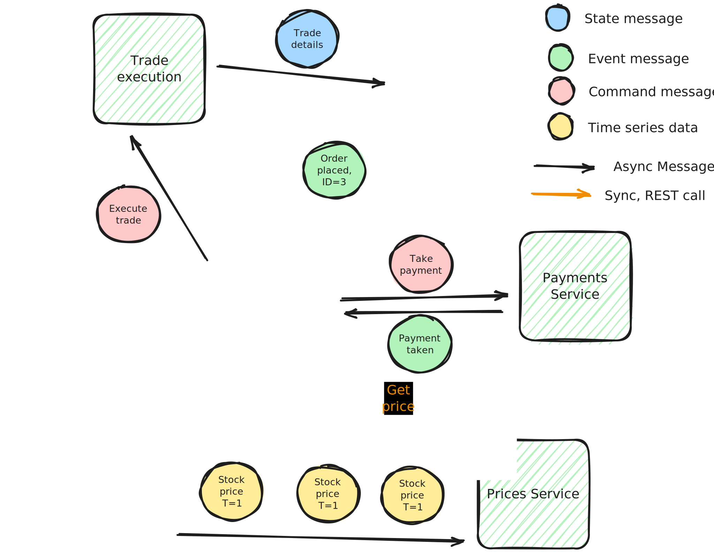
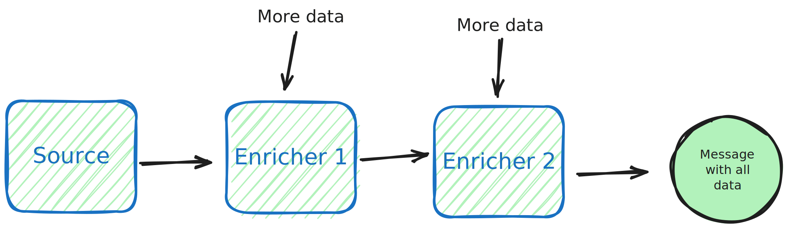
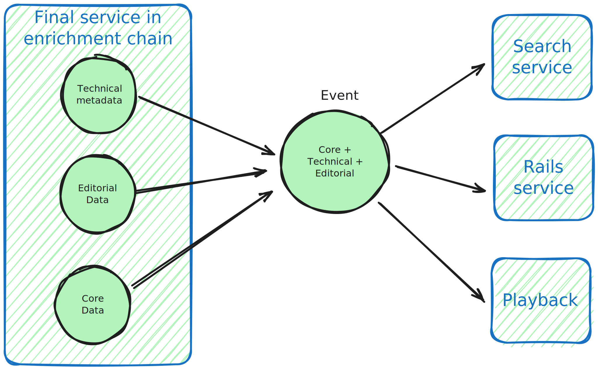

In my previous [blog post](https://blog.scottlogic.com/2023/11/14/data-distribution.html) I looked at various technologies for sending data asynchronously between services including RabbitMQ, Kafka, AWS Eventbridge. This time round I'll look at how you structure the data that you send on them. 

To make this clearer see the diagram below of an imaginary financial trading application:



There's lots of data flying around from asyncronous instructions to execute trades to real time pricing data. I've coloured the data entities according to their types and we see there's a few different patterns which raises the question of "what's the right pattern to use?". That's what we'll discuss today.  

 Be aware that the data you send is relatively independent of the data bus choice. Whilst each solution has it's particular focus (e.g. some have "event" in the name), the reality is that you can send whatever you want, (subject to payload size which can be limited to 256KB upwards).

 
## Terminology and types of data
To begin I think it's useful to classify the different types of message we might send before going into more detail on each and when to use them in the following sections. The obvious ones are:

<table>
  <tr>
    <th>Type</th>
    <th>Example</th>
  </tr>
  <tr>
    <td>Events</td>
    <td><ul>
      <li> User Created (ID=55)</li>
      <li> A cloud event like "ECS instance 343 started" </li>
    </ul></td>
  </tr>
  <tr>
    <td>Commands/Instructions/Request</td>
    <td><ul>
      <li>Send a reset password email to user X </li>
      <li>Take payment for £x from user Y</li>
    </ul></td>
  </tr>
  <tr>
    <td>State</td>
    <td><ul>
      <li>User (complete object)</li>
      <li>Product (complete object)</li>
      <li>Order (complete object)</li>
    </ul> </td>
  </tr>
  <tr>
    <td>Time series values</td>
    <td><ul> 
      <li>Stock price</li>
      <li> Error rate metric on API</li>
    </ul></td>
  </tr>
</table>

Time series data is both the state of a single thing, but I'd argue that it is distinct because of it's periodic nature where an update is sent whether it has changed or not and the fact that latency can often be far more important. 

In the following sections we'll dive into some of these in more detail but let's start with 2 that isn't even in the list, "messages"

### Terminology: Messages
Documentation, blogs and books sometimes talk about messages when referring to the use of queues/data buses.  

I use the term *message* as a generic term for asynchronous communication that may be state or commands or events.

## Events vs State
An event says that something has happened or changed, e.g. "Account Created". 
It might have a payload (ignoring timestamps and metadata) like 
```
{
  "EventType": "ACCOUNT_CREATED"
  "ID": "8c0fd83f-ff3f-4e0e-af4b-2b7470334efa"
}
```
If you want to know about the details of the particular account then you need to get it by some other route like an HTTP request to an accounts REST API or whatever interface is in place. 

*State* on the other hand contains a full object, it contains the full state for whatever entity has been created or changed. 

e.g.

```
{
  "EntityType": "ACCOUNT"
  "ID": "8c0fd83f-ff3f-4e0e-af4b-2b7470334efa",
  "Name": "David",
  "Email": "An email@domain.com",
  "Tel: {
    "Type: "Mobile"
    "Country Code": "44"
    "777777777"
  }
  .....etc
}
```
In this example I have chosen not to say if it is created or updated. A downstream doesn't necessarily care if they saw an earlier message, they'll just check if they already have the particular entity or not. 

State messages are common when going down an event sourcing route with the event log as the source of truth rather than a database.

The division between events and state can be a little bit grey. There are sometimes half way solutions where an event has some common info, like the email above but not the more detailed information. Sometimes an event is just one field, e.g. an "Email Changed" event includes the email and so carries state. 

Sometimes a state message may include before and after or a change list with the field names that have changed. 

The following table summarises the differences:
<table>
  <tr>
    <th>Feature</th>
    <th>Event</th>
    <th>State</th>
  </tr>
  <tr>
    <td>Payload</td>
    <td>An ID and enum to say what happened</td>
    <td>A full data entity</td>
  </tr>
  <tr>
    <td>Event type</td>
    <td>Enum identifying a specific thing that happened like EMAIL_UPDATED</td>
    <td>Entity name (typically but may also say if created or updated) like PROFILE</td>
  </tr>
  <tr>
    <td>Followup calls</td>
    <td>Yes, API request needed</td>
    <td>No</td>
  </tr>
  <tr>
    <td>Updates</td>
    <td>Identified by event name but no way to see old value</td>
    <td>Typically not conveyed if a state is new or update but sometimes a message will have old and new state</td>
  </tr>
  <tr>
    <td>Message size</td>
    <td>Small</td>
    <td>Medium or Large</td>
  </tr>
  
</table>

### Tradeoffs
I wouldn't say there's a right or wrong option here it will depend on a few things. 

#### Number of consumers
As the consumer volume goes up the advantage of the stateful approach is that you don't end up with heavy load on an API. Imagine a cluster of 100 messages going onto a bus arriving at 15 consumers at the same time. You've then got 1500 requests in a second or two to your API

#### Resilience
Relating to the number of consumers, if your API is not that reliable then the stateful option can be better for resilience because you don't have a dependency on both the message bus and the API, just on the message bus in order to get all the data. 

#### Coupling
A few points here like resilience are really a form of coupling. If a service must call an API on another serice to get data it is more closely coupled to that service than a state message solution where the consumer needs to know nothing about the producer and isn't dependent on it's name, resilience, API schema etc

#### Data Transfer Volumes
If most consumers don't care about most of the state (maybe one or two fields each) then the event option reduces the data transfer. It's not a major plus for small focused state objects (e.g. 10-20 fields) but more important if sending large chunks of data around going into the 10s kBs.

#### Downstream simplicity
Let's say you take the stateful approach with complete objects like a user profile or account and no change list. Let's also say you want to send emails or an SMS to the user for security reasons when properties like the email address change. Any service that is responsible for this has have it's own state so it can compare before and after and see the email changed.

On the other hand if you had a single event saying "email changed" (with the new email or available via API) then the processing service can be stateless.

##### Schema management
You have to keep 2 schemas in sync for the stateful approach and a lot of messaging systems don't have good support for schema management compared to APIs. 


##### Aggregations
See later section on complexities of normalisation vs denormalisation. But in short, if a service needs a few entities to do its work then having an event and a REST call simplifies this. With the state approach you have to either:

 1. construct an aggregation state message with all the entities.  
 2. Have the consumer stash 1 or more messages whilst they wait for the related ones

With an event then the consumer will just get everything they need by 1 or more REST calls

### Instructions/commands/requests
An instruction or command is a request to "do X". For example, imagine a commerce site or government service that organises postal delivery once a payment is made or some other action. Asynchronously this may work 2 ways:
 * there's a delivery service listens to generic ORDER_PLACED events (or order state) and acts upon them to arrange delivery.
 * The order system (or an intermediary service that consumes the ORDER_PLACED events and knows certain things must happen) writes out a "PREPARE_DELIVERY" intruction or similar to a delivery service. 

The message will typically contain all the necessary information for the downstream to do it's work (although it could require a follupcall as per the event pattern already discussed). Generally because an instruction is quite targetted there is no reason to not have the relevant data in the message unless there's any large files or images needed that are best not transmitted on the message bus. 

#### Commands vs state/events

I would say the differces are:

 * A state message is quite generic and there could be a few services interested in it. 
 * An command is more specific and targetted at a particular consumer - it's still loosely coupled and asynchronous but much more specific. 
 * With a command there is often an expectation of a response back via another message to confirm that it has been received and accepted or not. 

My personal take on this is that commands into an workflow where you want to keep coupling low but nonetheless you are requesting something to happen and you care that it does happen. You may want to be able to bring up on a dashboard the state of the user's order and its delivery and take action where there are problems. Such a scenario often benefits from an orchestrator, e.g. something like Camunda or Uber Cadence or AWS Step Functions.

With events and state messages then the source system (or an orchestrator) doesn't take any responsibility for what happens when it has done its work. It just throws out a message saying "my work is done" and moves on and it's up to other services to decide what to do and to provide a view on the state of the downstream actions. An obvious corollary of this is that where transmitting state, if any essential downstreams depend on it then the messaging system must be very robust because there's no opportunity for retries or flagging errors in the source system.

## Time series data
I am not going to say a lot here because the question of what to put in the message is a lot more obvious: 

* 1 or more values, 
* the value type(s) 
* a timestamp. 

The challenges are primarily around the message bus and the consumer. e.g. working out when all data has arrived in a given time period (See watermarks in [Streaming Systems](https://www.oreilly.com/radar/the-world-beyond-batch-streaming-102/)) and finding the right balance between risk of data loss vs throughput and latency. But what to put in the message itself


## Complexities
Now we've been through some message types let's consider some of the complexities that can be encountered in trying to construct a sensible and coherent message strategy. 

### Complexities 1: Field Granularity
One of the difficult decisions to make with both events and state (though more commonly an issue for state) is around how granular to go in your messages. 

Let's consider 2 cases:

1. imagine we have an event like "EMAIL_UPDATED" -  this is a very specific event about a specific field of data and a listener knows what they are listening for. 

2. Alternatively a message is at the level of a user profile where a profile includes the email, postal address and much else then you'd get and you get a "PROFILE UPDATED" or for state PROFILE_STATE message. 

In option 2 a consumer system that only cares about the email doesn't know if the email changed or not without doing a comparison. They may end up processing a large volume of messages unnecessarily if some other field regularly changes that they don't care about which may be fine but is a waste of cost and energy. It may also cause unintentional coupling as a system starts using a field that it receives but was never intended to process - this is discussed more later on. 

#### Challenge of going very granular
Going to granular field level messages means there's focused events or state where a consumer knows exactly what has happened and only subscribes to relevant changes but....this has a knock on effect for producers. Think about how we structure our APIs, we often have a POST or PUT that updates a group of fields together. For example, where a user has a page with a large form to fill out or even a few separate pages but where the request isn't sent to the server till the end. 

In this case we could send a separate event for every field (with the producer doing some form of diff to the existing)but there's downside to this:

 * we may end up sending a few messages out when one "PROFILE STATE" message would have been sufficient. 
 * a consumer needing the full state (i.e. sum of a few messages) has to wait for all messages before proceeding - so you've fixed one consumer problem but made another
    * Maybe it doesn't know if there's followup messages or not either and there's a message watermark challenge - when do you have all the data
 * What if there is a transactional nature to the data and it shouldn't be coming in pieces but needs to be treated as atomic.

So ultimately there's a compromise in producer complexity, number of messages send, consumer complexity and processing effort. 

Another option is a change list with the state. Care is needed though because where there are no ordering guarantees and/or where a consumer may get information from multiple sources then you don't know the latest state that the consumer has and it is better to just say "here's the latest coherent state as one object", replace what you have with this. Similarly you could have before and after state in one message with the same concern applying. 

I am not sure there is a perfect answer - just go with what best suits the nature of your data and consumers and be consistent. 


### Complexities 2: Consistency with input-event mismatch

Let's expand on the transactional point earlier. 
Assume that you always send state but there's 2 endpoints that feed into that state that may be called in quick succession. 

In the earlier user profile example imagine the profile exists as a single JSON object in a database and there's a single JSON profile state message but..... there are separate REST endpoints for changing email and postal addresses because of complexities like email validation which is its own journey. You don't want a situation whereby one message has the new postal address but old email and the other is vice versa. 

Generally it's easier to send separate messages if there's separate APIs but it goes back to the previous discussion on granularity. 
 

### Complexities 3: Normalization vs de-normalization
In the previous sections we were more focused on the messages from a particular service and how they related to input APIs. There's a related but wider point though across multiple services which is normalisation.
In the relational database world it is normal to talk about how far to normalise your data. When it comes to sending data between services this is much less discussed but is also important. 


Imagine we have some sort of flow like the above where there's source data that gets enriched gradually with additional data as it flows through multiple services. 
To take an example I am familiar with, video streaming, then in the final system there might be something like this:



 Multiple services like search, playback, home page need a few entities to do their work, e.g. core video data, technical metadata, localised editorial data and so they all use the large aggregated message from the last service in the chain. 

 The first obvious problem of an enrichment flow like above is the cost of change. It means that if a new field gets added in the source service then all the later services in the chain have to also add it (unless treating as opaque BLOBs). Thus changes become expensive. 
 
 Secondly, the chance of something going wrong with the data between source and destination increases

Even if we avoid a long pipeline we may still have some aggregation points so let's explore some of the challenges of this and then some advantages. 


#### Aggregation challenges 1:  Inconsistency in denormalised or aggregated state messages
A touched on already, when aggregating, try and avoid a situation where 2 messages conflict
```
message: {
  "technicalData": {
    "bitRate": 3.5
  }
  editorialData: {
    "description_en": "a description"
  }
}
```
If one message has the latest technical data and the next the latest editorial then you've got a problem!
So if you are aggregating and this is a risk (which it will may well be if not gating the messages with a DB and transactions and ) then have versioning of timestamps at the level of the sub-entities not just the message itself. 

#### Aggregation challenges 2: Security in aggregated messages and accidental coupling 
With REST and other APIs it is normal to have access controls saying which endpoints an be accessed by who.

If you go down a denormalised path this can be lost because you are putting data that may be  read with REST via 2+ enpoints into one state message. Most messaging servics, e.g. Kafka, RabbitMQ don't allow you to control who gets which fields in the message.
There are exceptions though, e.g. AWS Eventbridge

This means that going down the state transfer route as opposed to events can limit your security when the messages contain an aggregation of multiple REST endpoint paylods. 

There's also a risk accidental coupling. Imagine you have a particular field in a state message that is only really intended for one service and you think that if you need to change it it'll be a quick conversation with that one service's dev team. However, maybe this field is surfaced via the large aggregated message everyone's using because this was quickest and easiest option. Over time developers in other teams may choose to use (or misuse it) and you have no visibility.  Suddenly you can't make a change because you'll break lots of services, not just the original intended one. 

#### Advantages of aggregation

Given some of the points above architecturally the cleanest option for sending state in normalised messages where downstreams consume multiple small focused entities directly from source systems and only register for the ones of interest to them.

What's the downside of this? Let's say a consumer needs 2 entities to do any useful work and it is storing them in a relational database with a foreign key constraint. If the messages come in the wrong order it has to stash one of them whilst waiting for the other because you can't write into the database if the referenced entity doesn't exist. 


If a consumer is effectively stateless unfortunately it must still have storage if it needs to aggregate multiple normalised messages. 

Where many downstreams all need the same aggregation you are forcing them all to do the same logic around stashing entities and waiting for all the data to come in.

#### Final thoughts on normalisation
My advice would be to generally prefer normalised small entities but be flexible and consider the implementation expense of downstream consumer services. 

Pragmatically it is sometimes ok to add an aggregation service that can join data as a convenience function and such a service should treat all fields excep join IDs as opaque objects to keep the cost of change down. Keep such a service standalone and don't add business logic. 

I'd recommend avoiding enrichment pipleline flows. 

### Complexities 4: Duplicates 
Most messaging services offer at least once but not exactly once delivery semantics. Many don't provide an ordering guarantee. Therefore you should ensure messages include a timestamp or version number and that they have a unique ID. Downstreams must be advised to be idempotent. 


## Conclusions
In this blog I've gone through some types of message that you can send on your message bus and given some reason why they all get more complex that you might hope. 

We've seen that instructions are typically used in a workflow where you care about the receipt of that instruction and want to know the state of the action off the back of it. 

On state and events, I'm not sure there's ever a 100% correct approach just tradeoffs dependent on the number of consumers, the relationships between your data entities. If I must leave the fence, well I used to favour state but I've found it can be more complex than expected especially for consumers so now I lean slightly towards events:

* only one API for getting the data - don't need to keep 2 in sync
* consumers don't have to assemble objects turning up in random order
* one source of truth accessible via the one API

 Still it does mean tighter coupling between services, won't always scale if consumer numbers are high. 

Whatever you go for, try and make it consistent and logic and don't go into it accidentally, have a clear plan and design according to the route you pick. Don;t randomly mix instructions, state and events without any clear reasoning behind why you are using each. Finally do pay proper attention to data consistency and duplicates


