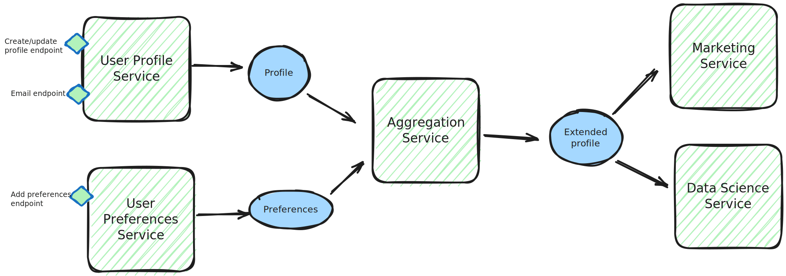
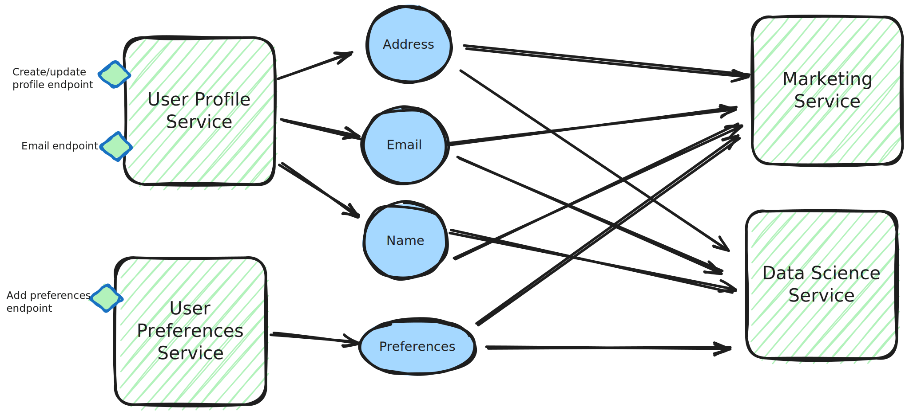

In part 1 I compared various message types including events, state transfer, commands and time series data. I discussed the key characteristics of each and when and where to use each type but I didn't go into depth on the data you might pack into those messages so that's what I am going to talk about here.  

The design of message payloads is an important topic that I don't think is given as much time and thought as it should be. In the relational database world a lot of thought is given to the schema design, to getting the right entities, the right level of normalisation and the correct relationships between tables. My experience is that we do a lot less of this in service to service messaging and so I'll try give this some attention including looking at some of the complications that occur and topics like granularity, normalisation and enrichment pipelines. 

## Granularity

To understand what I mean by granularity consider the following diagram for a made up example of user services:  


There's a core profile service and then another for storing more application specific preferences. The core profile service has a separate email change endpoint as this comes with extra logic around validation and security. 
Nonetheless the profile service puts out a single message including all profile data for convenience. Similarly for convenience, between the two services there is an aggregation component producing messages for consumers that have everything about the user. Think of it as a big like using Graph QL to get all your related user data in one go in a synchronous API.

e.g. we have the following 2 entities coming from the services:
<table>
  <tr>
    <td>
      <pre>
      <code>
      {
         "Entity": "PROFILE"
         "ProfileID": "8c0fd83f",
         "email": "john.smith@google.com",
         "mobile": "0777777777",
         "address": {
            "number": 45,
            "postcode": "AA1 1AA"
         }
      }
      </code>
      </pre>
   </td>
   <td>
      <pre>
      <code>
      {
         "Entity": "PREFERENCES"
         "ProfileID": "8c0fd83f",
         "musicPreferences":
            "genrePreferences": ["rock"],
            "artistPreferences": ["Paul Simon"]
         }
      }
      </code>
      </pre>
   </td>
</tr>
</table>

and this coming from the aggregation service:

<pre>
<code>
{
   "Entity": "PROFILE_AGGREGATED"
   "ProfileID": "8c0fd83f",
   "email": "john.smith@google.com",
   "mobile": "0777777777",
   "address": {
      "number": 45,
      "postcode": "AA1 1AA"
   },
   "musicPreferences": {
      "genrePreferences": ["rock"],
      "artistPreferences": ["Paul Simon"]
   },
     
}
</code>
</pre>

An alternative approach might be:



where we have lots of smaller messages and they are never joined for the consumers. 
e.g. 
<pre>
<code>
      {
         "Entity": "EMAIL"
         "ProfileID": "8c0fd83f",
         "email": "john.smith@google.com",
      }
</code>
</pre>

Breaking this down, there's 3 decision points here where specific choices around granularity have been made:
 1. Should each endpoint send out an event matching the endpoint payload
    * or should divide it into smaller messages for particular field sets
       * e.g. a message per preference type rather that one preferences message
 2. Should one endpoint aggregate into its messages data that has come from another endpoint
    * e.g. profile contains the email
 3. Should multiple messages (from multiple systems) be aggregated before they reach consumers

I'll describe these in a bit more detail before moving on to the advantages and pitfalls. 

### Endpoint to message mapping
Let's say there is a single update profile REST endpoint, e.g. PUT /profile where the XML/JSON payload includes an email, postal address, phone number etc. (i.e. no separate email endpoint for now)

When generating a message there is a choice between
 1. sending out one "PROFILE UPDATED" event or state message
 2. sending out separate ones like "EMAIL_CHANGED", "ADDRESS_CHANGED" etc 
    * an address itself could divde down to postcode, number etc although this wouldn't make a lot of sense as the fields change together. 
    * bear in mind that a PUT to the endpoint may provide a new version of all fields or more likely in UI use cases just a few related fields may change, e.g. house number and postcode

In the first a consumer system that only cares about the email doesn't know if the email changed or not without doing a comparison because maybe the postcode changed or some other field. They may end up processing a large volume of messages unnecessarily if some other field regularly changes that they don't care about. Functionally this may be fine but it won't help non-functions around cost and energy. Change lists can reduce the effort but see later discussion. 

In the second option a consumer will subscribe to particular fields they are interested in but there will be more messages when multiple fields change at the same time. 

### Aggregation across endpoints

Next let's think about the scenario shown in the diagram with a separate endpoint for changing the email (we'll ignore complexities of changing email and assume one PUT). 
We could send a EMAIL_CHANGED state message and a PROFILE_UPDATED one (without the email) when the profile endpoint is hit. But... wouldn't a consumer expect to find an email in a profile message. If we find that persuasive then we might just send a "PROFILE UPDATED" message including the email when either endpoint is hit so the consumer has one simple message to listen for regardless of how the change occurred. 

Such an approach makes good sense but comes with some consistency risks that'll we'll discuss shortly

### Aggregation across services
Finally we may choose to aggregate multiple messages before delivery to a set of consumers. This, as we'll see can simplify consumers as they get all the data they want in one single message but it too has some costs around consistency. 

## Normalisation
As well as granularity there is also the question of normalisation, and how much data we duplicate across messages. 
Consider an application processing sports data. Imagine there is a separate state messge for a tournament, a fixture and a team amongst other entities. 

If messages were normalised then each of these would have distinct unique data and there only connections would be via IDs. e.g.

<pre>
<code>
{
   "Entity": "FIXTURE"
   "ID": "c51df36c-4635-4568-99d7-64a143bc0599",
   "datetime": 10:00, 23/04/1983 UTC
   "homeTeam": "bafffb74-66d0-458d-b909-67def02f9616",
   "awayTeam": "d4ab14b7-99ed-41a1-bddb-3848781d8ef6",
   "venue": "572ccbd1-a37f-44e7-b8ce-be64588782ed",
   "tournament": "0f504d3b-d76a-4aaa-b628-5e9eeaa10bdc"
}
</code>
</pre>

<pre>
<code>
{
   "Entity": "TEAM"
   "ID": "bafffb74-66d0-458d-b909-67def02f9616",
   "datetime": 10:00, 23/04/1983 UTC
   "name": "Manchester City",
   "shortName": "Man City",
   "location": "Manchester",
   "sponsor": "Ethiad"
}
</code>
</pre>

<pre>
<code>
{
   "Entity": "TOURNAMENT"
   "ID": "0f504d3b-d76a-4aaa-b628-5e9eeaa10bdc",
   "datetime": 10:00, 23/04/1983 UTC
   "name": "Premier League",
   "shortName": "Man City",
   "location": "Manchester",
   "sponsor": "Barclays"
}
</code>
</pre>

However, relating to the aggregation point described already, it might be convenient for consumers if the fixture message included within it information about the teams like the team names and the tournament name. In this case we see the same data duplicated across multiple messages.

<pre>
<code>
{
   "Entity": "FIXTURE"
   "ID": "c51df36c-4635-4568-99d7-64a143bc0599",
   "datetime": 10:00, 23/04/1983 UTC
   "homeTeam": {
      "ID": "bafffb74-66d0-458d-b909-67def02f9616",
      "name": "Manchester City",
      "shortName": "Man City",
      "location": "Manchester",
      "sponsor": "Ethiad"
   },
   "awayTeam": {
      .....
   },
   "tournament": { 
      "ID": "0f504d3b-d76a-4aaa-b628-5e9eeaa10bdc",
      "datetime": 10:00, 23/04/1983 UTC
      "name": "Premier League",
      "shortName": "Man City",
      "location": "Manchester",
      "sponsor": "Barclays"
   },
   .......
}
</code>
</pre>

This is a form of aggregation but the distinguishing features relating to the earlier examples are:

 1.  That we have still included the distinct messages as well as the aggregated, e.g. tournament exists as its own message as well as within each fixture.  This means that we have 2 sources of truth, a point we'll come back to. 
 2. There is a many to one relationship where for one tournament there are many fixtures which is a common scenario in relational database table design. 

<s>What's the cost of doing this? Well imagine that the sponsor changes and imagine that there are 200 fixtures in the tournament - at this point 200 messages are generated for the denormalised case when 1 would have been sufficient for the normalised one with separate distinct messages. </s>

## Challenges and tradeoffs
Now we'll have a look at the different features and tradeoffs you'll need to consider when deciding on a data model for your messages. 

### Message volumes
If finer grained messages are used, e.g. one for email, one for phone number, one for postal address etc rather than a single *profile* message then it seems pretty obious that there's going to be a lot more messages sent. However it isn't quite that simple; at the producer there's less messges for sure, but what if a service is only interested in a single field. 

If we had the very specific message types then a consumer would be able to subscribe to the specific type and never have anything pushed to them that they aren't interested in. 

Going back to our example at the start with preferences and the profile, assume the following statements are true:
 * user preferences changes a lot but email doesn't. 
 * most services do care if the email changed but not someone's preferences

In this case, if we had a single aggregated message then all consumers would receive an update when the preferences change even though they don't care! So although there's less producer messages with the aggregation, after fan out there could actually be more messages delivered overall to consumers

#### Fan out
Let's look back to the normalisation example a short while ago - imagine what happens if the tournament sponsor changes and this needs reflecting on all upcoming fixtures. With the normalised data, where the fixtures only have an ID, then a single message is sent out with the new tournament sponsor. On the other hand, if the tournament data is also included in all the fixture messages (for consumer convenience) then all those fixtures must be sent again. If there's hundreds of fixtures against a tournament, that's a lot of extra messages that need to be delivered and they'll all come in a burst which may impact other functionality. 

That's not to say the denormalised option is always wrong, the convenience tradeoff may be worth it in many cases but be aware of the costs in both message volume and the need to recalculate and send all the entities that reference the thing that might change, in this case, all the fixtures.  

### Consistency
Consider the case where we have aggregated 2 entities as per the original example:
```
message: {
  "core_profile": {
    "email": "name@domain.com",
    .....
  }
  "user_preferences": {
    .......
  }
}
```
If one message has the latest profile but older user preferecces and the next the latest preferences but older profile then you've got a problem! You could at least add versioning or timestamps at the level of the sub-entities but consumers must be aware of this. 

Such a scenario can occur both within a service or when aggregating messages from multiple services. 
For the former imagine that the preferences and the email endpoints are hit in quick succession from a client but go to 2 different instances of the application. Each may read an old version of the data from the other endpoint when providing the full profile message. This is a strong reason not to aggregate within a service where you can't guarantee linear ordering in the reads and writes all the way through to the message.

On a related point use a timestamp from the DB not when you send a message, otherwise if one sending thread runs slow it'll look like the later message but have older data.  

As a counter to the other points, sometimes going very granular can be bad for consistency because some fields change together. To give a trivial example a postcode would always be tied to the house number but the same can also be true in less obvious scenarios. e.g.TODO maybe something around delivery address 

#### Normalisation
The nice thing about normalised messages is that for the contents of the messages there's only one source of truth. This isn't true for the de-normalised versions.

In our earlier example, we have the fixture and the tournament message both containing the same information. If some property of the tournament changes then there'll be 2 messages: one for the fixture (inc. tournament) and one for the tournament alone. Until a consumer has received both they will have an inconsistent view of the tournament and it might result in different data being displayed to a user from one view to the next. 

So in this case the presence of the de-normalised messages means there are 2 sources of truth and in turn means there can be some temporary consistency for anyone consuming both messages. Eventual consistency will apply though once all messages are received. 

### Understanding what has changed
When a consumer receives a message like:
<pre>
<code>
   {
      "Entity": "PROFILE"
      "ProfileID": "8c0fd83f",
      "email": "john.smith@google.com",
      "mobile": "0777777777",
      "address": {
         "number": 45,
         "postcode": "AA1 1AA"
      }
   }
</code>
</pre>
how does it know which field or fields actually changed? In short it doesn't unless it does a field by field diff with its own data store. Why might this matter, well consider the case where you want to send an email as a security message if the email changes but not if it was the other fields. 

Two solutions are:

 * to include a change list with the state 
 * to incude before and after state in one message. 
 
 Care is needed though because where there are no ordering guarantees and/or where a consumer may get information from multiple sources then you don't know the latest state that the consumer has. Going back to the consistency concerns, imagine a consumer gets a more up to date message first with a name change and then receives an older message with an email change. It might ignore the second message as being out of date. Sometimes it is cleaner to just say "here's the latest coherent state as one object", replace what you have with this rather than providing complex change lists that a consumer must use in combination with message timestamps. 


### Security in aggregated messages and accidental coupling 
With REST and other APIs it is normal to have access controls saying which endpoints an be accessed by who.

If you go down an aggregation path this can be partially lost because one state message contains data that  may be read with REST via 2+ endpoints each with separate controls. Most messaging servics, e.g. Kafka, RabbitMQ don't allow you to control who gets which fields in the message althought there are exceptions like AWS Eventbridge

What this means that going down the state transfer route as opposed to events can limit your security when the messages contain an aggregation of multiple REST endpoint paylods. 

There's also a risk of accidental coupling. Imagine you add a new field that is only really intended for one consumer. You think that if you ever need to change it it'll be a quick conversation with that one consumer service's dev team. However, perhaps this field is surfaced via the large aggregated message everyone's using because this was quickest and easiest implementation option. Over time developers in other teams may choose to use (or misuse it) and you have no visibility.  Suddenly you can't make a change because you'll break lots of services, not just the original intended one.


### Producer complexity
Going to granular field level messages means there's focused events or state where a consumer knows exactly what has happened and only subscribes to relevant changes but....this has a knock on effect for producers. Think about how we structure our APIs, we often have a POST or PUT that updates a group of fields together. For example, think about a web page with a large form to fill out or even a few separate pages but where the request isn't sent to the server till the end once all data is collected.

### Consumer complexity

TODO - sort out this bit below i removed from above
a consumer needing the full state (i.e. sum of a few messages) has to wait for all messages before proceeding - so you've fixed one consumer problem but made another
Maybe it doesn't know if there's followup messages or not either and there's a message watermark challenge - when do you have all the data

Most messaging services offer at least once but not exactly once delivery semantics. Many don't provide an ordering guarantee. Therefore you should ensure messages include a timestamp or version number and that they have a unique ID. Downstreams must be advised to be idempotent. 


Given some of the points above architecturally the cleanest option for sending state in normalised messages where downstreams consume multiple small focused entities directly from source systems and only register for the ones of interest to them.

What's the downside of this? Let's say a consumer needs 2 entities to do any useful work and it is storing them in a relational database with a foreign key constraint. If the messages come in the wrong order it has to stash one of them whilst waiting for the other because you can't write into the database if the referenced entity doesn't exist. 


If a consumer is effectively stateless unfortunately it must still have storage if it needs to aggregate multiple normalised messages. 

Where many downstreams all need the same aggregation you are forcing them all to do the same logic around stashing entities and waiting for all the data to come in.

## Enrichment pipelines


## Final thoughts
My advice would be to generally prefer normalised small entities but be flexible and consider the implementation expense of downstream consumer services. Generally I'd match messages to the data sent to an endpoint. 

Pragmatically if lots of consumers need the same combination of entities it is sometimes ok to add an aggregation service that can join data as a convenience function. Such a service should treat all fields except join IDs as opaque objects so as to keep the cost of change down, i.e. adding a field doesn't come with a lot of system changes. Keep such a service standalone and don't add business logic. 

I'd recommend avoiding enrichment pipleline flows. 


