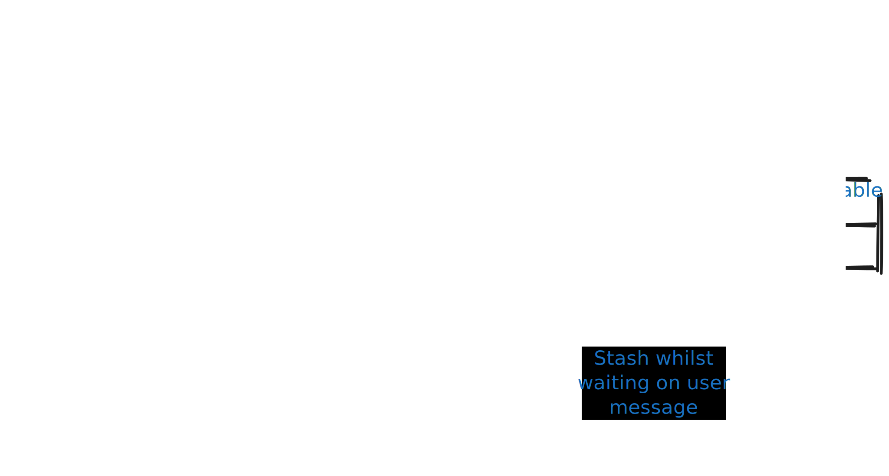

In part 1 I looked at the differences between events, state transfer, commands and time series data. I didn't go into much depth though on the precise details of the payloads, it was more about the classes of message.  

I think the design of message payloads is quite an important topic that isn't given as much time and thought as it should be. In the relational database world when designing a schema a lot of thought is given as to the right entities, the level of normalisation and the relationships between tables. My experience is that this is given a lot less time when it comes to messages and so I'll try and address this, looking at some of the complications that occur with certain event patterns, including granularity, normalisation and enrichment pipelines. 

## Granularity

To understand what I mean by granularity consider the following diagram: 

We see 2 applications/services and 3 endpoints. The profile service has a separate email change endpoint as this comes with extra logic around validation and security. 
Nonetheless the service puts out a single message including all profile data. 

Additionally there is a user preferences service for general user preferences. Many consumers want all this data so there is an aggregation service producing messages for consumers that have everything about the user. 

There's 3 decision points here where specific choices have been made in the above example:
 * Should each endpoint send out an event matching the payload
    * or divide it into smaller messages for field sets
 * Should one endpoint aggregate into its messages data that has come from another endpoint
 * Should multiple messages (from multiple systems) be aggregated before they reach consumers

I'll describe these in a bit more detail before moving on to the advantages and pitfalls. 

### Endpoint to message mapping
Say there is a single update profile REST endpoint, e.g. PUT /profile with a payload including an email, postal address, phone number etc. 

When generating a message there is a choice between sending out one "PROFILE UPDATED" event or state message or separate ones like "EMAIL_CHANGED", "ADDRESS_CHANGED" etc and address itself could divde down to postcode, number etc although this wouldn't make a lot of sense as the fields change together. 

In option 1 a consumer will subscribe to this particular field because they are interested in its value. 

In option 2 a consumer system that only cares about the email doesn't know if the email changed or not without doing a comparison because maybe the postcode changed or some other field. They may end up processing a large volume of messages unnecessarily if some other field regularly changes that they don't care about. Functionally this may be fine but it won't help non-functions around cost and energy. Change lists can reduce the effort but see later discussion. 

### Aggregation across endpoints
Let's consider the simplest scenario of a single endpoint, "Update email" in some user profile service. There is a question over how much data to put in a message once the email changes (we'll ignore complexities of changing email).  

Consider 2 cases for when this changes in a particular service:

1. An event like "EMAIL_UPDATED" is emitted or state with just the email -  this is a very specific message about a specific field of data. 
2. Alternatively there is a "PROFILE UPDATED" event message or a PROFILE state message where a profile includes the email, postal address and much else as per the earlier diagram. 


### Aggregation across services

## Challenge of going very granular
Going to granular field level messages means there's focused events or state where a consumer knows exactly what has happened and only subscribes to relevant changes but....this has a knock on effect for producers. Think about how we structure our APIs, we often have a POST or PUT that updates a group of fields together. For example, think about a web page with a large form to fill out or even a few separate pages but where the request isn't sent to the server till the end once all data is collected. 

In this case we could send a separate event for every field (with the producer doing some form of diff to the existing)but there's downside to this:

 * we may end up sending a few messages out when one "PROFILE STATE" message would have been sufficient
    * with heavy consumer fan out it can lead to a lot of messages 
 * a consumer needing the full state (i.e. sum of a few messages) has to wait for all messages before proceeding - so you've fixed one consumer problem but made another
    * Maybe it doesn't know if there's followup messages or not either and there's a message watermark challenge - when do you have all the data
 * What if there is a transactional nature to the data and it shouldn't be coming in pieces but needs to be treated as atomic.

So ultimately there's a compromise in producer complexity, number of messages send, consumer complexity and processing effort. 

An obvious option is to include a change list with the state or you could have before and after state in one message. Care is needed though because where there are no ordering guarantees and/or where a consumer may get information from multiple sources then you don't know the latest state that the consumer has. Say a consumer gets a more up to date message first with a name change and then receives an older message with an email change. It might ignore the second message as being out of date. Sometimes it is cleaner to just say "here's the latest coherent state as one object", replace what you have with this rather than complex change lists that a consumer must use in combination with the message timestamp. 

I am not sure there is a perfect answer on granularity - just go with what best suits the nature of your data and consumers and be consistent. So if you have lots of fields that change independently via a fine grained API then go with fine grained messages and vice versa and accept there may be some complexities on edge cases whichever way you go. 

### Challenges: consistency
Try and avoid a situation where 2 messages conflict
```
message: {
  "technicalData": {
    "bitRate": 3.5
  }
  editorialData: {
    "description_en": "a description"
  }
}
```
If one message has the latest technical data and the next the latest editorial then you've got a problem!
So if you are aggregating and this is a risk (which it will may well be if not gating the messages with a DB and transactions) then have versioning of timestamps at the level of the sub-entities not just the whole message. 

This can occur both within a service or when aggregating from multiple services. 

For the former imagine that the preferences and the email endpoints are hit in quick succession from a client but go to 2 different instances of the application. Each may read an old version of the data from the other endpoint when providing the full profile message. This is a strong reason not to aggregate within a service where you can't guarantee linear ordering in the reads and writes through to the message.

Also on the subject of consistency, as mentioned in part 1, use a timestamp from the DB not when you send a message, otherwise if one sending thread runs slow it'll look like the later message but have older data.  

#### Change lists
An obvious option is to include a change list with the state or you could have before and after state in one message. Care is needed though because where there are no ordering guarantees and/or where a consumer may get information from multiple sources then you don't know the latest state that the consumer has. Say a consumer gets a more up to date message first with a name change and then receives an older message with an email change. It might ignore the second message as being out of date. Sometimes it is cleaner to just say "here's the latest coherent state as one object", replace what you have with this rather than complex change lists that a consumer must use in combination with the message timestamp. 

I am not sure there is a perfect answer on granularity - just go with what best suits the nature of your data and consumers and be consistent. So if you have lots of fields that change independently via a fine grained API then go with fine grained messages and vice versa and accept there may be some complexities on edge cases whichever way you go. 

## Normalisation
Consider an application processing sports data. Imagine there is a separate state messge for a tournament, a fixture, team and a sports ground message. 

If messages were normalised then each of these would have distinct unique data and there only connections would be via IDs. However, relating to the aggregation point described already, it might be convenient that the fixture message included within it information about the teams like the team names and the sports ground the fixture is to be played at. In this case we see the same data duplicated across multiple messages.

What's the cost of doing this? Well imagine that a small detail on the tournament changes and imagine that there are 200 fixtures in the tournament - at this point 200 messages are generated for the denormalised case when 1 would have been sufficient for the normalised one with separate distinct messages. 

## Security in aggregated messages and accidental coupling 
With REST and other APIs it is normal to have access controls saying which endpoints an be accessed by who.

If you go down a denormalised path this can be lost because you are putting into one state mess data that may be read with REST via 2+ endpoints each with separate controls. Most messaging servics, e.g. Kafka, RabbitMQ don't allow you to control who gets which fields in the message althought there are exceptions like AWS Eventbridge

What this means that going down the state transfer route as opposed to events can limit your security when the messages contain an aggregation of multiple REST endpoint paylods. 

There's also a risk of accidental coupling. Imagine you add a new field that is only really intended for one consumer. You think that if you ever need to change it it'll be a quick conversation with that one consumer service's dev team. However, perhaps this field is surfaced via the large aggregated message everyone's using because this was quickest and easiest implementation option. Over time developers in other teams may choose to use (or misuse it) and you have no visibility.  Suddenly you can't make a change because you'll break lots of services, not just the original intended one.


### Complexities 4: Duplicates 
Most messaging services offer at least once but not exactly once delivery semantics. Many don't provide an ordering guarantee. Therefore you should ensure messages include a timestamp or version number and that they have a unique ID. Downstreams must be advised to be idempotent. 

#### Advantages of aggregation

Given some of the points above architecturally the cleanest option for sending state in normalised messages where downstreams consume multiple small focused entities directly from source systems and only register for the ones of interest to them.

What's the downside of this? Let's say a consumer needs 2 entities to do any useful work and it is storing them in a relational database with a foreign key constraint. If the messages come in the wrong order it has to stash one of them whilst waiting for the other because you can't write into the database if the referenced entity doesn't exist. 



If a consumer is effectively stateless unfortunately it must still have storage if it needs to aggregate multiple normalised messages. 

Where many downstreams all need the same aggregation you are forcing them all to do the same logic around stashing entities and waiting for all the data to come in.


#### Challenge of going very granular
Going to granular field level messages means there's focused events or state where a consumer knows exactly what has happened and only subscribes to relevant changes but....this has a knock on effect for producers. Think about how we structure our APIs, we often have a POST or PUT that updates a group of fields together. For example, think about a web page with a large form to fill out or even a few separate pages but where the request isn't sent to the server till the end once all data is collected. 

In this case we could send a separate event for every field (with the producer doing some form of diff to the existing)but there's downside to this:

 * we may end up sending a few messages out when one "PROFILE STATE" message would have been sufficient
    * with heavy consumer fan out it can lead to a lot of messages 
 * a consumer needing the full state (i.e. sum of a few messages) has to wait for all messages before proceeding - so you've fixed one consumer problem but made another
    * Maybe it doesn't know if there's followup messages or not either and there's a message watermark challenge - when do you have all the data
 * What if there is a transactional nature to the data and it shouldn't be coming in pieces but needs to be treated as atomic.

So ultimately there's a compromise in producer complexity, number of messages send, consumer complexity and processing effort. 

An obvious option is to include a change list with the state or you could have before and after state in one message. Care is needed though because where there are no ordering guarantees and/or where a consumer may get information from multiple sources then you don't know the latest state that the consumer has. Say a consumer gets a more up to date message first with a name change and then receives an older message with an email change. It might ignore the second message as being out of date. Sometimes it is cleaner to just say "here's the latest coherent state as one object", replace what you have with this rather than complex change lists that a consumer must use in combination with the message timestamp. 

I am not sure there is a perfect answer on granularity - just go with what best suits the nature of your data and consumers and be consistent. So if you have lots of fields that change independently via a fine grained API then go with fine grained messages and vice versa and accept there may be some complexities on edge cases whichever way you go. 


 


#### Final thoughts on normalisation
My advice would be to generally prefer normalised small entities but be flexible and consider the implementation expense of downstream consumer services. 

Pragmatically if lots of consumers need the same combination of entities it is sometimes ok to add an aggregation service that can join data as a convenience function. Such a service should treat all fields excep join IDs as opaque objects so as to keep the cost of change down. Keep such a service standalone and don't add business logic. 

I'd recommend avoiding enrichment pipleline flows. 


