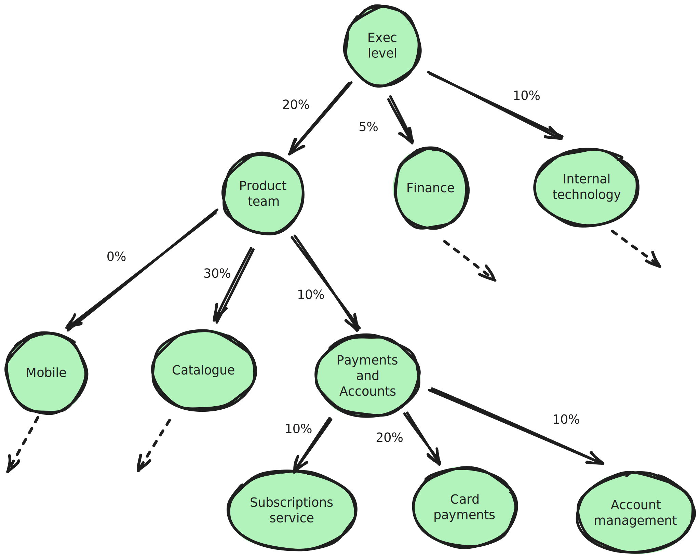

Until now, the non-functional-requirements that have driven our architecture and development decisions have focused on areas like performance, security and resiliency, with scant consideration for the environmental impacts of these choices. 
 
In the face of the increasing global temperatures, the technology sector must now take action to address this imbalance – particularly as the proportion of global carbon emissions deriving from ICT is currently expected to rise from 4% to 14% by 2040.
 
In this blog post, I focus on how to set sustainability NFRs so that you have a carbon or efficiency target alongside your security and availability targets. Sustainability is a wide topic, as my colleague Oliver Cronk explained in this [post](https://blog.scottlogic.com/2023/10/26/conscientious-computing-facing-into-big-tech-challenges.html); I’ll accordingly concentrate on CO2 emissions as this is an area that developers can influence directly, unlike an area such as water usage which is largely in the control of the data centre provider.   
 
In order to understand more about NFRs and why we need to start introducing them for sustainability, please see this earlier post. 

To start, I’ll look briefly at why we aren’t setting NFRs around emissions, why it’s tricky and then suggest some ideas to make this easier. 

### Why aren’t we writing sustainability NFRs?
My experience is that most architects and senior engineers wouldn’t think twice about setting NFRs for performance or scalability yet very rarely set them for sustainability. 

I suspect the reason is that the costs are generally someone else’s problem in the sense that we don’t personally suffer the effects of our service’s emissions.  Contrast with the case where your app is running too slowly and the engineering team will get a callout.  

This is a bit like cost management where it’s common for a development team to be given a platform to run apps on with no worry about the costs as another part of the business covers it.  This is now changing with cost and may do so with carbon emissions as excess emissions come with a financial hit that will be pushed down to teams. 

### Why is creating sustainability NFRs difficult?

In short it's hard to say in advance that software service A should generate X emissions per month, because every application is slightly different and has different usage patterns. It’s not as simple as something like availability with a set of standard achieveable values like [99%, 99.5%, 99.9%, …..] that is well understood. 

Like cost, carbon emissions will very much depend on other  NFRs like performance and availability. There is a mentality where we set those other NFRs as independent variables and a cost (financial or carbon) results as a dependent variable.  We need to move to a mentality where carbon is weighed up independently against all the other NFRs. 

## Principles for setting carbon emission NFRs
Now we’ve said why it’s tricky, let’s try and see how we can improve the situation and set useful NFRs. Firstly, before we can set an NFR we need to work out what we are trying to reduce in more concrete terms. 

### What are we actually trying to reduce?
Before you say carbon emissions, remember that in technology there’s many sources of those emissions. When setting NFRs we should be sure to think about all of these, especially where our organisation’s targets include Scope 3 emissions like manufacture of servers. See the Scott Logic proposed carbon standard for a summary: 

Typically, each NFR will target a different category, e.g. one NFR may be about employee laptop refreshes and thus Category U, and another about running more efficiently on a user’s browser, targeting Category D. All emissions are important but different people and teams can impact different categories.

### Direct vs indirect NFRs
I’d argue that  when writing sustainability and carbon NFRs we have 2 classes of NFR: direct and indirect. i.e. we can directly address carbon emissions or target some other indirect measure that when optimised also improves emissions.  For example, a target value of server utilisation will also benefit carbon.  Both types of NFR bring value and indirect may be more manageable as a starting point before you get good at measuring your emissions.

### Getting a business steer – top down targets
NFRs are designed to ensure the software or hardware meets business or regulatory needs. For example, an availability number is about the cost to reputation or lost sales if a website or API is offline. 

To see how this can work for CO2 emissions consider an example where an organisation has pledged to reduce its Scope 2&3 emissions by 10% over 2 years. This may be divided up across the company either evenly (10% everywhere) in an uneven way according to the ease of making improvements and sizes of departments. A similar exercise may be done at different levels cascading down all the way to individual teams and/or services. 

In this case the subscriptions team will get a carbon budget from their existing emissions and the 10% reduction requirement. Observe that cost and carbon NFRs encourage decommissioning as new components will eat into the existing and falling budget.

### Setting realistic numbers
Targets from above work well for a % improvement but can be more challenging for a new service or where trying to work out where to focus efforts. You may not have a good feel for the problem, for what’s ambitious but realistic and so can’t quickly assign a number like say 100ms latency or 1 year data retention. In this situation I'd say the preferred options are:
•	Find something similar that already exists and come up with a relative number
•	Do a spike

Obviously coming up with a relative number requires some ability to measure and understand your existing services in terms of energy and carbon emissions so getting this sorted may be a pre-requisite to setting more mature direct NFRs. 

A spike will allow a rough approximation of the right figure, e.g. energy or CO2 per user request without doing significant development. With a spike, you avoid all the complexities of writing proper infra-as-code, tests, robust error handling, carefully managed metrics etc and can just get a feel for how the main business logic may run and how much energy it should use. 

Over time, this should become easier if knowledge is built up and shared (both within and between companies), leading to good case studies and examples.

### Indirect NFRs

When setting an indirect NFR you will find it useful to start with some solid principles, a good example of which are the Green Software Foundation Green Software Principles below:

These show us 3 different focus areas. Be aware that hardware efficiency and energy efficiency are related but distinct: efficient code can use less hardware but that depends on how efficiently you use the hardware, e.g. one server per app isn’t very efficient, even if the app is small and fast.  Hardware also takes account of how often you refresh hardware and how efficient its manufacturing was. 

An improvement in emissions may often be met by more than one of these, e.g. you could double efficiency of code or run with electricity with half the carbon intensity. 

One level down from this, you may have particular aims like making more use of serverless, reducing network chattiness or reducing the staff IT footprint; NFRs should flow from these objectives and promote them.  

## Writing a good NFR
This could really be the topic of a few blog posts itself but let’s consider a few quick points before diving into some examples. 

### Quantitative vs qualitative
NFRs are sometimes a measurable number and sometimes more descriptive:

<table>
  <tr>
    <th>Classification</th>
    <th>Examples</th>
  </tr>
  <tr>
    <td>Quantitative</td>
    <td><ul>
      <li>Availability should be 3 9s</li>
      <li>Feature x shouldn’t add more than 10% latency to the mean request time.</li>
      <li>Website B should have the same page load time as website A within 50ms</li>
    </ul></td>
  </tr>
  <tr>
    <td>Qualitative</td>
    <td><ul>
      <li>Scale horizontally</li>
      <li>Prefer the simplest solution</li>
      <li>Service should be observable from end to end down to container level</li>
    </ul></td>
  </tr>
 
</table>

Quantitative is preferred over qualitative so that there is something to aim for, test for and validate against. Quantitative may be absolute or relative, with the former preferred but the latter may be simpler initially when aiming for improvement. The “scale horizontal” item above might be better expressed as, “service can scale linearly in cost and resources with request per second numbers between 0 and 2m”. 
Qualitative ones will sometimes need discussion as to what the intent is and whether an implementation plan meets it. 

### Scale factor
With many NFRs, it is sensible to put in a scale factor, otherwise growth in the company may cause the numbers to be exceeded. 
My recommendation would be that per-user targets are used as well as per-request ones where appropriate, (e.g. API design) in order to encourage sensible design that minimise the emissions in serving each user. Remember that it’s great if a single request generates low emissions but not if ten requests are needed where one may have been sufficient. 

### Relevance
NFRs should promote the important characteristics of a system and a project should not be overwhelmed with excessive numbers of NFRs, many of which are not important and provide a distraction. Similarly, NFRs should be appropriate in their asks and not unnecessarily difficult. 
As an example, we don’t need to push tight carbon emissions per request for a service called a few times a day – it won’t have a useful impact on the wider company’s emissions. On the other hand, it might be useful to have an NFR that will flag up where systems are not being scaled down for, e.g. average power of the service over a day or an NFR to check the average scaling of the service. 

## NFR Examples and Suggestions
In this section, I’ll present some examples of NFRs that promote carbon sustainability and then in later sections discuss how to arrive at these. 
Many will promote energy efficiency or low carbon at the same time as other NFRs including cost, observability and simplicity. For each one, I’ve provided the following information:

*	An “ility” or similar to summarise, as is common with NFRs 
*	The NFR itself
*	Info about why this NFR can help, and any complications
*	A category from the Scott Logic carbon standard
*	The main principles it addresses from the Sustainable Software Principles
They are grouped according to the different teams or groups or people who would be paying attention to them, like IT procurement and data development. 

### Hardware purchasing/procurement
NFRs are not just for writing software and should also be deployed in decisions around hardware, be that user laptops or new server or networking hardware. The aim should be to encourage the purchase of equipment that will last a long time, have low embodied carbon, run efficiently, and be easy to monitor.

<table>
  <tr>
    <th>NFR</th>
    <th>More Info</th>
    <th>Category</th>
    <th>GSF Principles</th>
  </tr>
  <tr>
    <td><b>Longevity</b> Prefer laptops/servers that can be used for the longest time, ideally 5 years+</td>
    <td>Want procurement to favour laptops with longer lifespans and longer support contracts – higher immediate price vs less long term</td>
    <td>U</td>
    <td>Hardware efficiency</td>
  </tr>
  <tr>
    <td><b>Hardware sustainability</b> Buy laptops with < 300kg embodied carbon</td>
    <td>Favour suppliers who provide information on embodied emissions and use the greenest manufacturing. May have to be weighed against a price NFR</td>
    <td>U</td>
    <td>Hardware efficiency</td>
  </tr>
  <tr>
    <td><b>Hardware efficiency</b> Buy servers with < x embodied carbon per unit of work</td>
    <td>Will push purchases towards larger servers with high core count chips so less HW overhead. Requires a fair comparison between ARM, AMD, Intel</td>
    <td>U</td>
    <td>Hardware efficiency</td>
  </tr>
  <tr>
    <td><b>Observability</b> prefer servers with easy energy monitoring</td>
    <td>Favour on-prem server hardware that will allow measurement and tracking of emissions</td>
    <td>Energy Efficiency</td>
    <td>O/G</td>
  </tr>
  <tr>
    <td><b>Disposability</b> Servers should come with an end of life disposal plan</td>
    <td></td>
    <td>D</td>
    <td>Hardware efficiency</td>
  </tr>
</table>

### Platform
Where a central team is providing clusters, databases etc for development teams they will have NFRs and principles to follow around tooling, security etc and should add sustainability objectives to these

<table>
  <tr>
    <th>NFR</th>
    <th>More Info</th>
    <th>Category</th>
    <th>GSF Principles</th>
  </tr>
  <tr>
    <td><b>Re-usability</b> Server utilisation should be > 50%</td>
    <td>Less servers needed if utilising all to the max (allowing for headroom for busier periods)</td>
    <td>O/C/G</td>
    <td>Hardware efficiency</td>
  </tr>
  <tr>
    <td><b>Carbon intensity</b> Cluster should use electricity < 200g CO2e/kWh</td>
    <td>Ensures resources are created in low carbon data centres or cloud regions – rather than random or distance based choice </td>
    <td></td>
    <td></td>
  </tr>
  <tr>
    <td><b>Emissions efficiency</b> . Overhead emissions per application &lt;NgCO2</td>
    <td>Care is needed with technologies like service meshes and WAFs to ensure a lot of heavyweight sidecars aren’t added to every app so useful to look at the overhead emissions on each app</td>
    <td></td>
    <td></td>
  </tr>
  <tr>
    <td><b>Observability</b> Teams running on platform infra should be able to see their specific emissions</td>
    <td>If teams can’t see what is attributed to them then it is hard for them to improve</td>
    <td></td>
    <td></td>
  </tr>
</table>

### Development - general
<table>
  <tr>
    <th>NFR</th>
    <th>More Info</th>
    <th>Category</th>
    <th>GSF Principles</th>
  </tr>
  <tr>
    <td><b>Re-usability</b> Feature X should result in 0kg additional embodied carbon</td>
    <td>A new feature should make use of existing hardware. Assumes existing hardware with spare capacity 
</td>
    <td>U</td>
    <td>Hardware efficiency</td>
  </tr>
  <tr>
    <td><b>Emissions efficiency</b> Service should generate &lt N gCO2 /user/day</td>
    <td>Having an emissions rate to aim for gets development teams to consider efficiency with a concrete number to aim for on a new implementation</td>
    <td>O/C/G</td>
    <td>Carbon aware, Energy efficiency</td>
  </tr>
  <tr>
    <td><b>Emissions</b> Service B should generate 10% less emissions than existing service A per request</td>
    <td>Drives gradual improvement over a known existing service as organisational knowledge develops</td>
    <td>O/C/G</td>
    <td>Carbon aware, Energy efficiency</td>
  </tr>
  <tr>
    <td><b>Efficiency</b> Service should use no power when not serving requests</td>
    <td>For a service not heavily used this drives developers towards an architecture is not wasting energy with nothing happening, e.g. scaling to 0 or serverless</td>
    <td>O/C/G</td>
    <td>Energy Efficiency</td>
  </tr>
  <tr>
    <td><b>Emissions efficiency</b> Workflow should result in  &ltN gCO2 per submission across all components</td>
    <td>Ensures that the aggregate energy being used in a workflow is considered and measured and also helps ensure energy isn’t wasted when not processing submissions. </td>
    <td>O/C/G</td>
    <td>Carbon aware, Energy efficiency</td>
  </tr>
  <tr>
    <td><b>Efficiency</b> Workflow  should use no power when not serving requests</td>
    <td>As above, need to ensure no energy is wasted when there is no work to do. Again may push towards implementations like lambdas.</td>
    <td>O/C/G</td>
    <td>Energy efficiency</td>
  </tr>
</table>

### Development - data
<table>
  <tr>
    <th>NFR</th>
    <th>More Info</th>
    <th>Category</th>
    <th>GSF Principles</th>
  </tr>
  <tr>
    <td><b>Dormancy</b> Data older than 3 years should be deleted</td>
    <td>Storing data needs hardware and by putting clear and short retention times we benefit not just GDPR but also embodied carbon</td>
    <td>U</td>
    <td>Hardware efficiency</td>
  </tr>
  <tr>
    <td><b>Dormancy</b> Data older than 1 year should be moved to offline storage</td>
    <td>This will push teams to have data move to out of instant access storage where not needed to somewhere offline without operational emissions. (may combine with more detail to ensure large data transfer doesn’t counter the benefit, e.g if in AWS S3, use S3 glacial)</td>
    <td>O/C/G</td>
    <td>Energy efficiency</td>
  </tr>
</table>

### Development - machine learning
<table>
  <tr>
    <th>NFR</th>
    <th>More Info</th>
    <th>Category</th>
    <th>GSF Principles</th>
  </tr>
  <tr>
    <td><b>Re-usability</b>Prefer SaaS/PaaS ML tooling for training and schedule when free</td>
    <td>If we use existing services to do ML training and use then when not busy we won’t add lots of GPUs that are rarely used. More applicable when only using hardware sporadically
</td>
    <td>U</td>
    <td>Hardware efficiency</td>
  </tr>
  <tr>
    <td><b>Emissions efficiency</b> ML Training and execution must be &ltN gCO2 per user per year</td>
    <td>Ensures that costs and carbon are kept under control in a machine learning application and unnecessarily large models are not used. </td>
    <td>O/C/G</td>
    <td>Carbon aware, Energy efficency</td>
  </tr>
  <tr>
    <td><b>Simplicity</b> Prefer the lowest power ML model that can successfully predict within 10%</td>
    <td>No need to go to a complex neural network if a simple regression would be sufficient</td>
    <td>O/C/G</td>
    <td>Energy efficiency, Hardware efficiency</td>
  </tr>
  <tr>
    <td><b>Simplicity</b> Favour use of existing LLM over new</td>
    <td>A Microsoft study found custom LLMs often perform worse than an off the shelf one with prompt engineering so this is designed to promote the latter</td>
    <td>O/C/G</td>
    <td>Energy efficiency, Hardware efficiency</td>
  </tr>
  <tr>
    <td><b>Scalability</b> Scale linearly in energy with users</td>
    <td>Certain ML techniques will scale better than others with parameters, input size etc so something like this promotes a good long term solution</td>
    <td>O/C/G</td>
    <td>Energy efficiency</td>
  </tr>
  <tr>
    <td><b>Minimality</b> Update model no more than monthly?</td>
    <td>Don’t unnecessarily retrain if not absolutely required for the business need. </td>
    <td>O/C/G</td>
    <td>Energy efficiency, Hardware efficiency</td>
  </tr>
  <tr>
    <td><b>Improvability</b> Training cost should drop 10% each month</td>
    <td>As we learn more about a model and performance we should be able to bring the cost down with regularization, pruning, dimensionality reduction so we could put a requirement on efficiency on iterations of a model</td>
    <td>O/C/G, U</td>
    <td>Energy efficiency</td>
  </tr>
  
</table>

### Development - front end
<table>
  <tr>
    <th>NFR</th>
    <th>More Info</th>
    <th>Category</th>
    <th>GSF Principles</th>
  </tr>
  <tr>
    <td><b>Energy efficiency. Single page view should use &lt;N kWh energy</b></td>
    <td>Promote web pages that don’t use a lot of battery or power on the user’s machine</td>
    <td>D</td>
    <td>Energy efficiency</td>
  </tr>
  <tr>
    <td><b>Efficiency. No page execution should take place when the user is not on the page</b></td>
    <td>Promote pages and web apps that are good citizens and don’t waste power wen not being used</td>
    <td>D</td>
    <td>Energy efficiency</td>
  </tr>
  <tr>
    <td><b>Responsiveness. Prefer push over pull</b></td>
    <td>Ensures maximum responsiveness with minimum energy as well as user benefits in quick updates and less mobile costs</td>
    <td>D</td>
    <td>Energy efficiency</td>
  </tr>
  <tr>
    <td><b>Efficiency. Favour server side aggregation</b></td>
    <td>Avoid lots of small requests each with a large overhead and wasted energy and instead use a GraphQL type solution</td>
    <td>D</td>
    <td>Energy efficiency</td>
  </tr>
</table>

## Formulating these
Now I’ve presented some examples of NFRs, I’ll next consider how you might formulate some of the less obvious ones linking back to the advice in earlier sections. 

### Web service estimates, e.g. “Service should generate N gCO2/user/day”
If we are developing a new service, how do we come to a value for N? We’ve already presented 2 options:
1.	Spike it to get a target
2.	Measure an existing service
    a.	Then aim for a 10% or otherwise improvement based on a top-down target or the improvements you think are easily possible
Another is to do a basic analysis, e.g.

1.	start with a number of requests per user 
2.	target a number of requests per second for what you view as an efficient implementation – 
a.	e.g. for a simple JSON lookup service, you think that 5k req/s should be possible with 4vCPUs across the app server and database or some multiple, e.g. 10k/s with 0.6vCPUs. 
3.	Then you can consider wattage of a vCPU and carbon intensity of electricity for an efficient cloud region to get to a target CO2 number. 

Such an analysis is hard to do, and a spike is preferred, but it can provide a point for discussion, get the development team thinking about efficiency and over time when it is implemented for real, you’ll learn more and be able to improve your models. 

### Workflow estimates, e.g. “workflow should result in average of &lt;N gCO2 per submission across all components”
Estimating the energy for a workflow can be challenging. Again ideally you might spike it and approximate the workflow via running multiple services with Docker Compose and measuring. 

For a very light analysis, perhaps the workflow has 10 automated different steps and the total processing time should only be order 5s (ignoring waits and data transfer); then you might want to consider the energy consumption of doing 5s of processing, e.g. taking a power of 20W for 2 vCPUs on average. It won’t be accurate but will flag up anything way above the expected. 

It can be simpler to have an NFR like “Workflow should use no power when not serving requests” to enforce the fact that everything scales to 0 when not receiving submissions, rather than worrying too much about power used whilst particular steps are in play unless volumes are high. 

### Machine learning estimates, e.g. “ML Training and execution must be &lt;N gCO2 per user per year”
When not experienced in this area, it may be best to focus NFRs on ensuring good practice like ensuring the spin down of unused resources and not buying a lot of expensive hardware when shared cloud resources could be used, running slower on lower power hardware where latency isn’t so important.  

Remember to include both training and execution where the former may be one-off and amortised, or more likely require updates at a cadence which could be anything from hourly to monthly.  

If you want a sensible target number and don’t have a target from the business then existing knowledge or spikes may be used to estimate the amount of training needed and model execution energy. Estimation of training effort (resources and time) is especially challenging – it’s not like serving a web request repeatedly. It’ll vary significantly on the amount of data, how much pre-processing that data needs, the number of features, layers of a neural net etc. Still, there is some guidance and tooling available, for example see [How to Estimate the Time and Cost to Train a Machine Learning Model](https://towardsdatascience.com/how-to-estimate-the-time-and-cost-to-train-a-machine-learning-model-eb6c8d433ff7)  and the referenced [training cost calculator](https://github.com/aipaca-mlops/ML-training-cost-calculator) tool. I’d suggest starting with quite loose requirements and then designing in iterations with tighter NFRs on later ones, with the exception of any huge GPT-style training where you might want to know in advance how much carbon it’ll create as it’ll blow your carbon budget just doing the training. 

For a training batch job that isn’t real-time, greater flexibility is possible in terms of when and where the workload is run, which allows lower estimates for the carbon intensity; this should accordingly make it a key focus area as an easy thing to target with NFRs.

### Websites and apps, e.g. “Single page view should use &lt;N kWh energy”
A relative basis here is one way to start, i.e. look at a variety of similar websites and compare their energy usage, e.g. via Firefox energy profiling. Then aim for the best example or better.

Alternatively, if time and resources allow, try to take one or two of the most popular pages on your site and re-implement them as best practice examples according to principles like those here: [Seven best practice tips to design low-carbon websites](https://medium.com/@joanna.esther.peel/how-to-design-low-carbon-websites-e188737b0b44)  and [Green Software Patterns](https://patterns.greensoftware.foundation/catalog/web/). You can then take this as a basis for setting targets.  Bear in mind that some things may be out of your control, like advertising plugins.

It may be useful to think about the energy per user for a given experience over time rather than just per-page metrics as they don’t account for designs that lead to many page loads to do a particular action. 

## Conclusions
In this post I’ve talked about why it can be tricky to write NFRs for minimising carbon emissions and then given some principles to try and make this easier. Following this, I’ve given some examples and provided guidance on how to come up with numbers where there's a lot of unknowns. I believe that there is much in common with cost management both in terms of the challenges in setting the NFRs and the benefits of setting them; many NFRs promoting low carbon will also promote low cost.

This is still a very new area, and the above are just suggestions for how to proceed based on common sense and what works with existing NFRs. I am unsure of exactly the right approach at this point, and I expect thinking and tooling around this to develop significantly over the next few years. Nonetheless, I hope the above sparks a few useful ideas if nothing else. In the next part, I’ll be looking at how to measure and enforce sustainability NFRs. 
