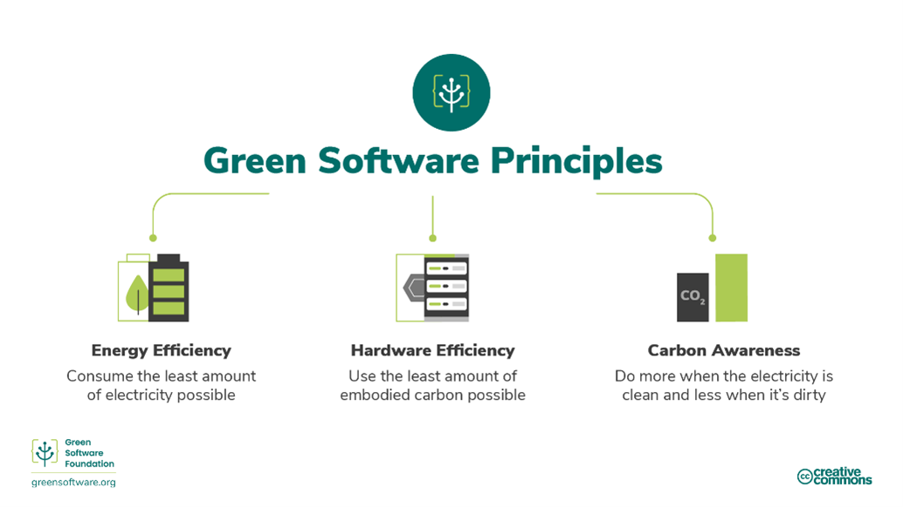
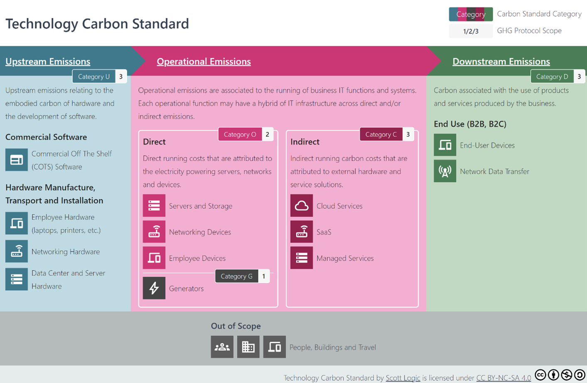

In this blog post I’ll discuss how you can set non-functional requirements (NFRs) for sustainability and provide some examples.
In order to understand more about NFRs and why we need to start introducing them for sustainability please see this earlier post. (TODO Insert link once live).

Sustainability is a wide topic but I’ll concentrate on CO2 emissions as this is an area that developers can directly influence unlike something like water usage which is in the control of the data centre provider.  

#### Scope
This blog post is all about setting the NFRs so you have a carbon or efficiency target alongside you security and availability targets. A subsequent post will look at how to measure CO2 NFRs and ensure software doesn’t deteriorate and continues to meet the targets over its lifetime. 

## What prevents us setting sustainability NFRs
Before going into the details of how to set NFRs I think it’s worth a quick discussion as to the challenges that make it tricky to get into the habit of providing sustainability NFRs.  I see this in terms of both organisational and technical challenges. 

### Organisational challenges
Sustainability can be likened to cloud cost management and the rise of FinOps. Cost management was (and still is in many orgs) quite immature and is often centred around looking at an existing estate and trying to reduce costs rather than baking them into requirements. Central platform teams provide compute and dev teams don’t consider the cost until an exec notices and demands reductions. Contrast this with the performance (e.g. latency) of a given service, responsibility for which would fall directly on the development team from day 1. 
A similar problem applies to sustainability concerns, but more so: with CO2 emissions environmental costs are not simply with a central platform team in one company but the whole world meaning there is an ownership problem. That said, this will change as reporting and regulatory constraints hold organisations more responsible for their specific emissions and gradually over time this pushes down to individual teams as is happening with FinOps. 

### Technical challenges
Let’s take an example of availability: we can pick a customer facing figure like 99.9% and utilise standard techniques like multiple instances, AZs/ data centres and multiple regions to reach that number. The particular details of the workload are to an extent irrelevant (but not completely of course) as standard patterns are applied to reach the number. 

Contrast this with financial cost: it's hard to say in advance that software service A should cost X per month as it will depend quite a lot on the complexity of the business logic and on the other NFRs like availability that may drive up cost so we don’t have standard values like [99%, 99.9%, 99.99%…..]. 

Similar challenges exist for carbon emissions. No one really knows what a particular type of service should cost in carbon for a given number of customers, and especially not in combination with other NFRs like performance and availability. Usually we set those and a cost (financial or carbon) results, not vice versa.

Despite these challenges there is plenty we can do as I’ll now explain starting with some principles behind setting NFRs. 

## A basis for setting sustainability NFRs
When setting NFRs it’s important to understand the drivers for them and to have a basis principles around what they affect and how to set them.

### Company targets
All NFRs are designed to ensure the software or hardware meets business needs. For example, an availability number is about the cost to reputation or lost sales if a website or API is offline. Similarly a business will have a view on carbon emissions and may be aiming to get to net zero within X years via a set of objectives and initiatives across the org.  Another top down driver might be emissions trading credits as per the EU Emissions Trading System where a metric tonne of CO2 is approximately 30 euros.. As permitted emissions fall and prices rise then it may be more useful to start relating the carbon cost to a financial price to drive NFRs. 

A 10% IT reduction objective may become a requirement for all teams to reduce their services 12% (to give margin for growth and additional services) and it may be decided to skew it if one area is known to be particularly inefficient. Either way it provides a carbon budget to individual areas and means a new service will need an emissions target based on the spare margin if additional rather than a replacement. 

These targets may be scopes 1 and 2 only or also include 3 in which case the range of approaches will be wider as manufacturing and embodied carbon must be thought about.

Note that such targets won’t exist in all companies are the lack of them is not a reason not to avoid setting sustainability NFRs – it’s just that it provides more clarity and drive for them where present.

### Green software principles 
Within a target there’s multiple ways to achieve it and to set good NFRs sensible principles are needed with a good place to start being the green software principles:

Hardware efficiency and energy efficiency are related but distinct: efficient code can use less hardware but that depends on how efficiently you use the hardware, e.g. one server per app isn’t very efficient even if the app is small and fast.  Hardware also takes account of how often you refresh hardware and how efficient it’s manufacturing was. 
An NFR may often be met by considering more than one of these. E.g. you could double efficiency of code or run with electricity with half the carbon intensity. 

One level down from this you may have particular aims like making more use of serverless, reducing network chattiness or reducing the staff IT footprint and NFRs should flow from these objectives and promote them.  

### Scott Logic Proposed Carbon Standard
The Technology Carbon Standard (TCS) breaks down emissions into different types from upstream to downstream as shown:

Typically a given NFR will target a different emissions standard according to the Technology Carbon Standard. E.g. one NFR may be about employee laptop refreshes and thus Category U and another about running more efficiently on a user’s browser so targeting Category D. All emissions are important but different people can impact different categories.
Classifications and writing a good NFR
NFRs are sometimes a measurable number and sometimes more descriptive:

<table>
  <tr>
    <th>Classification</th>
    <th>Examples</th>
  </tr>
  <tr>
    <td>Quantitative</td>
    <td><ul>
      <li>Availability should be 3 9s</li>
      <li>Feature x shouldn’t add more than 10% latency to the mean request time.</li>
      <li>Website B should have the same page load time as website A within 50ms</li>
    </ul></td>
  </tr>
  <tr>
    <td>Qualitative</td>
    <td><ul>
      <li>Scale horizontally</li>
      <li>Prefer the simplest solution</li>
      <li>Service should be observable from end to end down to container level</li>
    </ul></td>
  </tr>
 
</table>

Quantitative is preferred over qualitiative so there is something to aim for, test for and validate against. Quantitative may be absolute or relative with the former preferred but the latter may be simpler initially when aiming for improvement. The “scale horizontal” item above might be better as  “service can scale linearly in cost and resources with request per second numbers between 0 and 2m”. 
Qualitative ones will sometimes need discussion as to whether an implementation plan meets the intent and what is the intent. 

### Scale factor
With many NFRs it is sensible to put in a scale factor, otherwise growth in the company may cause the numbers to be exceeded. 
My recommendation would be that per user targets are used as well as per request ones where appropriate, (e.g. API design) in order to encourage sensible design that minimise the emissions in serving each user. Remember that it’s great if a single request generates low emissions but not if 10 requests are needed where one may have been sufficient. 

### Focus areas
When developing a service, or app or platform there will be some areas that are likely to be more important than others. Part of the job of NFRs is to highlight these and promote the important characteristics of a system. A project should not be overwhelmed with numerous NFRs many of which are not important and provide a distraction. Similarly NFRs should be appropriate in their asks and not unnecessarily difficult. 
As an example, we don’t need to push tight carbon emissions per request for a service called a few times a day – it won’t have a useful impact on the wider company’s emissions. On the other hand it might be useful to have an NFR that will flag up if systems are not being scaled down for, e.g. average power of the service over a day or an NFR to check the average scaling of the service. 
Similarly on data whilst proper dormancy and data management should be a general principle that apply to all software only give it more focus on those applications handling significant quantities. 

## NFR Examples and Suggestions
In this section I’ll present some examples of NFRs that promote carbon sustainability and then in later sections discuss how to arrive at these. 
Many will promote energy efficiency or low carbon at the same time as other NFRs including cost, observability and simplicity. For each one I’ve provided the following information:
* An “ility” or similar to summarise as is common with NFRs 
* The NFR itself
* Info about why this NFR can help and any complications
* A category from the Scott Logic carbon standard
* The main principles it addresses from the Sustainable Software Principles
They are grouped according to the different teams or groups or people who would be paying attention to them like the IT procurement and data development. 

### Hardware purchasing/procurement
NFRs are not just for writing software and should also be deployed in decisions around hardware be that user laptops or new server or networking hardware. The aim should be to encourage the purchase of equipment that will last a long time, have low embodied carbon, run efficiently and be easy to monitor.

<table>
  <tr>
    <th>NFR</th>
    <th>More Info</th>
    <th>Category</th>
    <th>GSF Principles</th>
  </tr>
  <tr>
    <td><b>Longevity</b> Prefer laptops/servers that can be used for the longest time, ideally 5 years+</td>
    <td>Want procurement to favour laptops with longer lifespans and longer support contracts – higher immediate price vs less long term</td>
    <td>U</td>
    <td>Hardware efficiency</td>
  </tr>
  <tr>
    <td><b>Hardware sustainability</b> Buy laptops with < 300kg embodied carbon</td>
    <td>Favour suppliers who provide information on embodied emissions and use the greenest manufacturing. May have to be weighed against a price NFR</td>
    <td>U</td>
    <td>Hardware efficiency</td>
  </tr>
  <tr>
    <td><b>Hardware efficiency</b> Buy servers with < x embodied carbon per unit of work</td>
    <td>Will push purchases towards larger servers with high core count chips so less HW overhead. Requires a fair comparison between ARM, AMD, Intel</td>
    <td>U</td>
    <td>Hardware efficiency</td>
  </tr>
  <tr>
    <td><b>Observability</b> prefer servers with easy energy monitoring</td>
    <td>Favour on-prem server hardware that will allow measurement and tracking of emissions</td>
    <td>Energy Efficiency</td>
    <td>O/G</td>
  </tr>
  <tr>
    <td><b>Disposability</b> Servers should come with an end of life disposal plan</td>
    <td></td>
    <td>D</td>
    <td>Hardware efficiency</td>
  </tr>
</table>

## Platform
Where a central team is providing clusters, databases etc for development teams they will have NFRs and principles to follow around tooling, security etc and should add sustainability objectives to these

<table>
  <tr>
    <th>NFR</th>
    <th>More Info</th>
    <th>Category</th>
    <th>GSF Principles</th>
  </tr>
  <tr>
    <td><b>Re-usability</b> Server utilisation should be > 50%</td>
    <td>Less servers needed if utilising all to the max (allowing for headroom for busier periods)</td>
    <td>O/C/G</td>
    <td>Hardware efficiency</td>
  </tr>
  <tr>
    <td><b>Carbon intensity</b> Cluster should use electricity < 200g CO2e/kWh</td>
    <td>Ensures resources are created in low carbon data centres or cloud regions – rather than random or distance based choice </td>
    <td></td>
    <td></td>
  </tr>
  <tr>
    <td><b>Emissions efficiency</b> . Overhead emissions per application <NgCO2</td>
    <td>Care is needed with technologies like service meshes and WAFs to ensure a lot of heavyweight sidecars aren’t added to every app so useful to look at the overhead emissions on each app</td>
    <td></td>
    <td></td>
  </tr>
  <tr>
    <td><b>Observability</b> Teams running on platform infra should be able to see their specific emissions</td>
    <td>If teams can’t see what is attributed to them then it is hard for them to improve</td>
    <td></td>
    <td></td>
  </tr>
</table>

### Development - general
<table>
  <tr>
    <th>NFR</th>
    <th>More Info</th>
    <th>Category</th>
    <th>GSF Principles</th>
  </tr>
  <tr>
    <td><b>Re-usability</b> Feature X should result in 0kg additional embodied carbon</td>
    <td>A new feature should make use of existing hardware. Assumes existing hardware with spare capacity 
</td>
    <td>U</td>
    <td>Hardware efficiency</td>
  </tr>
  <tr>
    <td><b>Emissions efficiency</b> Service should generate &lt N gCO2 /user/day</td>
    <td>Having an emissions rate to aim for gets development teams to consider efficiency with a concrete number to aim for on a new implementation</td>
    <td>O/C/G</td>
    <td>Carbon aware, Energy efficiency</td>
  </tr>
  <tr>
    <td><b>Emissions</b> Service B should generate 10% less emissions than existing service A per request</td>
    <td>Drives gradual improvement over a known existing service as organisational knowledge develops</td>
    <td>O/C/G</td>
    <td>Carbon aware, Energy efficiency</td>
  </tr>
  <tr>
    <td><b>Efficiency</b> Service should use no power when not serving requests</td>
    <td>For a service not heavily used this drives developers towards an architecture is not wasting energy with nothing happening, e.g. scaling to 0 or serverless</td>
    <td>O/C/G</td>
    <td>Energy Efficiency</td>
  </tr>
  <tr>
    <td><b>Emissions efficiency</b> Workflow should result in  &ltN gCO2 per submission across all components</td>
    <td>Ensures that the aggregate energy being used in a workflow is considered and measured and also helps ensure energy isn’t wasted when not processing submissions. </td>
    <td>O/C/G</td>
    <td>Carbon aware, Energy efficiency</td>
  </tr>
  <tr>
    <td><b>Efficiency</b> Workflow  should use no power when not serving requests</td>
    <td>As above, need to ensure no energy is wasted when there is no work to do. Again may push towards implementations like lambdas.</td>
    <td>O/C/G</td>
    <td>Energy efficiency</td>
  </tr>
</table>

### Development - data
<table>
  <tr>
    <th>NFR</th>
    <th>More Info</th>
    <th>Category</th>
    <th>GSF Principles</th>
  </tr>
  <tr>
    <td><b>Dormancy</b> Data older than 3 years should be deleted</td>
    <td>Storing data needs hardware and by putting clear and short retention times we benefit not just GDPR but also embodied carbon</td>
    <td>U</td>
    <td>Hardware efficiency</td>
  </tr>
  <tr>
    <td><b>Dormancy</b> Data older than 1 year should be moved to offline storage</td>
    <td>This will push teams to have data move to out of instant access storage where not needed to somewhere offline without operational emissions. (may combine with more detail to ensure large data transfer doesn’t counter the benefit, e.g if in AWS S3, use S3 glacial)</td>
    <td>O/C/G</td>
    <td>Energy efficiency</td>
  </tr>
</table>

### Development - machine learning
<table>
  <tr>
    <th>NFR</th>
    <th>More Info</th>
    <th>Category</th>
    <th>GSF Principles</th>
  </tr>
  <tr>
    <td><b>Re-usability</b>Prefer SaaS/PaaS ML tooling for training and schedule when free</td>
    <td>If we use existing services to do ML training and use then when not busy we won’t add lots of GPUs that are rarely used. More applicable when only using hardware sporadically
</td>
    <td>U</td>
    <td>Hardware efficiency</td>
  </tr>
  <tr>
    <td><b>Emissions efficiency</b> ML Training and execution must be &ltN gCO2 per user per year</td>
    <td>Ensures that costs and carbon are kept under control in a machine learning application and unnecessarily large models are not used. </td>
    <td>O/C/G</td>
    <td>Carbon aware, Energy efficency</td>
  </tr>
  <tr>
    <td><b>Simplicity</b> Prefer the lowest power ML model that can successfully predict within 10%</td>
    <td>No need to go to a complex neural network if a simple regression would be sufficient</td>
    <td>O/C/G</td>
    <td>Energy efficiency, Hardware efficiency</td>
  </tr>
  <tr>
    <td><b>Simplicity</b> Favour use of existing LLM over new</td>
    <td>A Microsoft study found custom LLMs often perform worse than an off the shelf one with prompt engineering so this is designed to promote the latter</td>
    <td>O/C/G</td>
    <td>Energy efficiency, Hardware efficiency</td>
  </tr>
  <tr>
    <td><b>Scalability</b> Scale linearly in energy with users</td>
    <td>Certain ML techniques will scale better than others with parameters, input size etc so something like this promotes a good long term solution</td>
    <td>O/C/G</td>
    <td>Energy efficiency</td>
  </tr>
  <tr>
    <td><b>Minimality</b> Update model no more than monthly?</td>
    <td>Don’t unnecessarily retrain if not absolutely required for the business need. </td>
    <td>O/C/G</td>
    <td>Energy efficiency, Hardware efficiency</td>
  </tr>
  <tr>
    <td><b>Improvability</b> Training cost should drop 10% each month</td>
    <td>As we learn more about a model and performance we should be able to bring the cost down with regularization, pruning, dimensionality reduction so we could put a requirement on efficiency on iterations of a model</td>
    <td>O/C/G, U</td>
    <td>Energy efficiency</td>
  </tr>
  
</table>

### Development - front end
<table>
  <tr>
    <th>NFR</th>
    <th>More Info</th>
    <th>Category</th>
    <th>GSF Principles</th>
  </tr>
  <tr>
    <td><b>Energy efficiency. Single page view should use <N kWh energy</b></td>
    <td>Promote web pages that don’t use a lot of battery or power on the user’s machine</td>
    <td>D</td>
    <td>Energy efficiency</td>
  </tr>
  <tr>
    <td><b>Efficiency. No page execution should take place when the user is not on the page</b></td>
    <td>Promote pages and web apps that are good citizens and don’t waste power wen not being used</td>
    <td>D</td>
    <td>Energy efficiency</td>
  </tr>
  <tr>
    <td><b>Responsiveness. Prefer push over pull</b></td>
    <td>Ensures maximum responsiveness with minimum energy as well as user benefits in quick updates and less mobile costs</td>
    <td>D</td>
    <td>Energy efficiency</td>
  </tr>
  <tr>
    <td><b>Efficiency. Favour server side aggregation</b></td>
    <td>Avoid lots of small requests each with a large overhead and wasted energy and instead use a GraphQL type solution</td>
    <td>D</td>
    <td>Energy efficiency</td>
  </tr>
</table>

## Formulating these 
Now I’ve presented some examples of NFRs I’ll next consider how you might formulate some of the less obvious ones.  I’ll start with some generalisations and then look
 at a few more concrete examples.

### Top down targets
As described in “Company Targets” a number may just come from a department carbon budget based on the company objectives. If a feature or service will use more carbon than this then it can’t go ahead or needs a long conversation so effort and innovation must go into meeting this. 

### Doing Spikes
As mentioned earlier, we don’t yet have standard or easy to decide values for carbon like we do for other NFRs such as a 5 minutes recovery time objective and 99.9% availability. Over time this should become easier if knowledge is built up and shared (both with within and between companies) leading to good case studies and examples.
Until this point, where it isn’t obvious what a number should be, then a spike may help. This will allow an rough approximation of the right figure, e.g. energy or CO2 per user request without doing significant development. With a spike you avoid all the complexities of writing proper infra-as-code, tests, robust error handling, carefully managed metrics etc and can just get a feel for how the main business logic may run and how much energy it should use. 

### Relative measures
The easiest option will generally be to specify an improvement relative to what you have be in top down or just set independently in a given team. If you have an existing API and are building a similar one then aim to be more efficient and continually improve. 

### More specific examples

#### Web service estimates, e.g. “Service should generate N gCO2/user/day”
If we are developing a new service how do we come to a value for N? I’d say there’s 3 options here:
1.	Spike it to get a target
2.	Measure an existing service
a.	Then aim for a 10% or otherwise improvement based on a top down target or the improvements you think are easily possible
3.	Do a basic analysis
For 3 you might want to start with a number of requests per user and targeting a number of requests per second for what you view as an efficient implementation. E.g. for a simple JSON lookup service you think that 5k req/s should be possible with 4vCPUs across the app server and database or some multiple, e.g. 10k/s with 0.6vCPUs. Then you can consider wattage of a vCPU and carbon intensity of electricity for an efficient cloud region to get to a target CO2 number. Such an analysis is hard to do and a spike is preferred but it can provide a point for discussion, get the development team thinking about efficiency and over time when it is implemented for real you’ll learn more and be able to improve your models. 

#### Workflow estimates, e.g. “workflow should result in average of <N gCO2 per submission across all components”
Estimating the energy for a workflow can be challenging. Again ideally you might spike it and approximate the workflow via running multiples with docker compose and measuring. Perhaps the workflow has 10 automated different steps and the total processing time should only be order 5s (ignoring waits and data transfer) then you might want to consider the power of doing  5s of processing, e.g taking a power of 20W for 2 vCPUs on average. It won’t be accurate will flag up anything way above the expected. 
It can be simpler to have an NFR like “Workflow should use no power when not serving requests” to enforce the fact that everything scales to 0 when not receiving submissions rather than worrying too much about power used whilst particular steps are in play unless volumes are high. 

#### Machine learning estimates, e.g. “ML Training and execution must be <N gCO2 per user per year”
Working out the cost of machine learning is not easy and so nor is coming up with a sensible target to promote good practice whilst being realistic. When not experienced in this area it may be best to focus NFRs on ensuring good practice like ensuring the spin down of unused resources, not buying a lot of expensive hardware when shared cloud resources could be used and that sort of thing.  
That said, a machine learning model will have an associated financial cost and carbon cost, perhaps according to company carbon targets or emissions credits as discussed earlier. In such a case there will be a carbon budget and the NFRs is saying that the ML features need to keep the emissions within these – which may be easy or may result in a compromise on performance.
The cost of a model will depend on both the training and the execution. Training may be one off and amortized or more likely require updates at a cadence which could be anything from hourly to monthly. 
Where bottom up approach is wanted it can be challenging to come up with a number. As with the above examples, existing knowledge or spikes may be used to estimate the amount of training needed and then find the most efficient hardware and region. E.g. we assume a particular size and number of CPUs/GPUs and an expected training time and similar for model execution. Estimation of training effort (resources and time) is challenging – it’s not like serving a web request repeatedly and this makes it difficult to provide a good NFR for. It’ll vary significantly on the amount of data, how much pre-processing that data needs, the number of features, layers of a neural net etc. Still, there is some guidance and tooling available, for example see How to Estimate the Time and Cost to Train a Machine Learning Model | by Yuqi Li | Towards Data Science and the referenced aipaca-mlops/ML-training-cost-calculator (github.com) tool. Numbers must be produced in collaboration with the data/ML team and experts in this field and not arbitrarily thrown down by architects – their job is to ensure the right considerations are being discussed around model complexity, where it runs, what will be good enough for the business as an output. 
I’d suggest starting with quite loose requirements and then designing in iterations with tighter NFRs on later ones with the exception of any huge GPT style training. 
For a training batch job that isn’t real time, greater flexibility is possible in terms of when and where the workload is run which allows lower estimates for the carbon intensity and so this should be a key focus area as an easy thing to target.

#### Websites and apps, e.g. “Single page view should use &ltN kWh energy”
A relative basis here is one way to start. i.e. look at a variety of similar websites and compare their energy usage, e.g. via Firefox energy profiling. Then aim for the best example or better.
Alternatively, if time and resources allow try and take 1 or 2 of the most popular pages on your site and re-implement as best practice examples according to principles like those here: Seven best practice tips to design low-carbon websites | by Joanna Peel | Medium and Web | Green Software Patterns. You can then take this as a basis for setting targets on those and other similar pages.  Bear in mind some things may be out of control like an advertising plugin.
It may be useful to think about the energy per user for a given experience over time rather than just per page metrics as they don’t account a design that leads to many page loads to do a particular action. 

## Conclusions
In this post I’ve explored the concepts around NFRs and what makes a good NFR. I’ve taken a look at the challenges with writing good NFRs for driving reductions in carbon emissions and shown the similarities with promoting good practices with cloud costs.  Following this I’ve given some examples of possible NFRs and provided some guidance on how to set the values in some of the trickier quantitative NFRs. 
This is still a very new area and the above are just suggestions for how to proceed based on common sense and what works with existing NFRs. I am unsure of exactly the right approach at this point and I expect thinking around this and tooling to develop significantly over the next few years. Nonetheless I hope the above sparks a few useful ideas if nothing else.
Nex time in the next part I’ll be looking at how to measure and enforce sustainability NFRs. 
